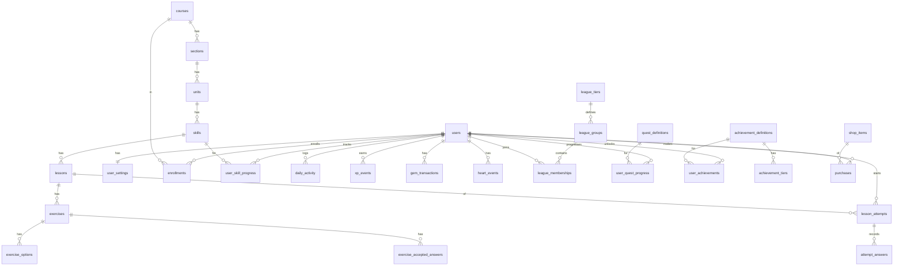

# Duolingo Web App Clone — Master Build Specification

> **Audience:** an LLM coding agent (Claude Code / Cursor / Copilot) that will build this project end to end.
> **Owner:** a B.Tech CSE student who must be able to **explain every line** in an interview. So: clean, readable, well-commented, conventional code. No clever tricks, no unexplained magic.
> **Source of truth order:** (1) the assignment brief (Section 1), (2) this file, (3) the reference repo for *ideas only*, (4) Duolingo's real UI for look and feel.

---

## 0. How the agent must work

1. Read this whole file first. Then build **phase by phase** (Section 16). Finish and verify a phase before starting the next.
2. Do not stop to ask questions. When something is ambiguous, pick the most Duolingo-like behaviour, implement it, and record the decision in `README.md > Assumptions`.
3. After every phase: run the backend tests, run `npm run build` and `npm run lint` in `frontend/`, fix everything, then commit with a clear message (`feat: lesson player – multiple choice`).
4. Everything must be **original code**. The assignment disqualifies plagiarism. The reference repo (`code-with-antonio/nextjs-duolingo-clone`) uses a different stack (Drizzle + Postgres + Clerk + Stripe + ElevenLabs), so **do not copy or port its code**. Use it only as a feature checklist (Section 19).
5. Do not scrape or copy Duolingo's proprietary assets (logo files, mascot artwork, audio). Recreate the *style* with your own SVGs, CSS and synthesized sounds.
6. Keep a running `docs/DECISIONS.md` (short bullets: what, why). It doubles as interview prep.
7. If time is short, drop work in this order: Bonus items (Section 2) → polish → never the Must-Have items.

---

## 1. Assignment brief (verbatim requirements, condensed)

**Goal:** Build a functional clone of the Duolingo web app that replicates its **design, UX, and core lesson and gamification workflows**. UI and UX should look and feel *exactly the same* as the original.

**Stack (mandatory):**
- Frontend: **Next.js (TypeScript)**
- Backend: **Python, FastAPI** (chosen over Django)
- Database: **SQLite** (own schema, will be evaluated)

**Must-have features**
1. **Learning path / skill tree:** units and skills with lock/unlock progression; completed / available / locked states; progress rings and crowns per skill; top bar with streak, XP, hearts and (mocked) gems.
2. **Lesson player:** sequence of exercises; types = multiple choice, translate (word bank / tap-the-words), match pairs, fill in the blank, type-the-answer; immediate correct/incorrect feedback with the signature feedback bar; progress bar; hearts (lose one per wrong answer, handle lesson failure); award XP and mark skill progress on completion.
3. **Gamification & progress:** streak that increments on daily activity (day logic simulatable/testable); XP totals and a leaderboard (can be seeded); hearts regeneration over time or via mocked practice/refill; daily goal indicator; **all progress persisted per user**.
4. **Content management:** units, skills, lessons, exercises stored in DB and seeded; learner profile page with stats (streak, total XP, achievements).
5. **Duolingo experience:** playful colourful UI with mascot-style flourishes; animated feedback; modals (lesson complete, out of hearts), toasts, celebratory states; path navigation and progress visuals; settings placeholders.

**Placeholders allowed ("Coming soon"):** speech recognition, purchases/Super, friends/social, multiple languages, real authentication (assume a default logged-in learner).

**Bonus (we are doing ALL of them):** audio for exercises, achievements/badges, real functioning leaderboard across seeded users, timed practice / "Legendary" challenge mode, dark mode, responsive design (mobile/tablet/desktop).

**Deliverables:** public GitHub repo with `frontend/` and `backend/`; README (setup, tech stack, architecture overview, database schema, API overview, assumptions); hosted working demo link.

**Evaluation criteria:** Functionality · UI/UX similarity · Database design · Backend/API design · Code quality · Code modularity · Code understanding.

---

## 2. Scope matrix

| Area | Status | Notes |
|---|---|---|
| Learning path with lock/unlock, rings, crowns, top bar | **Must** | Section 6.2 |
| Lesson player, 5 exercise types, feedback bar, progress bar, hearts, XP | **Must** | Section 6.3 |
| Streak, XP, daily goal, hearts regen/refill, leaderboard, persistence | **Must** | Section 7 |
| Profile page, DB-seeded content | **Must** | Sections 6.9, 9 |
| Modals, toasts, celebration screens, settings placeholders | **Must** | Section 6.4–6.5, 6.11 |
| Audio (TTS + synthesized sound effects) | **Bonus – do it** | Section 5.7 |
| Achievements / badges | **Bonus – do it** | Section 7.9 |
| Live leaderboard with leagues & bot simulation | **Bonus – do it** | Section 7.7 |
| Timed practice + Legendary challenge | **Bonus – do it** | Section 7.8 |
| Dark mode | **Bonus – do it** | Section 5.6 |
| Responsive (mobile / tablet / desktop) | **Bonus – do it** | Section 5.5 |
| Quests (daily + monthly), Shop (gems → hearts / streak freeze) | Extra (Duolingo parity + reference repo idea) | Sections 6.7, 6.8 |
| Dev tools panel (time travel, reset, set hearts) | **Must** (makes streak "testable") | Section 6.12 |
| Listening exercises (listen-tap, listen-type) | Bonus | Section 6.3.8 |
| Speaking, Stories, Letters, Friends, Super, real auth | Placeholder "Coming soon" | Section 6.13 |

---

## 3. Tech stack (pin versions in lockfiles)

**Frontend (`frontend/`)**
- Next.js 14+ App Router, React 18, **TypeScript strict mode** (no `any`)
- Tailwind CSS (design tokens in `tailwind.config.ts` + CSS variables for theming)
- State: **TanStack Query** (server state) + **Zustand** (lesson session / UI state)
- Animation: **Framer Motion**; confetti: `canvas-confetti`
- Icons: **own inline SVG components** (flame, gem, heart, bolt/XP, crown, star, lock, chest, trophy, check, x, speaker, turtle). Avoid icon libraries for the signature icons.
- Fonts: `next/font/google` **Nunito** (800 for headings, 700 for UI text) as the stand-in for Duolingo's proprietary Feather/DIN Rounded fonts.
- Lint/format: ESLint + Prettier. Tests: Vitest + React Testing Library (a few), Playwright for one end-to-end lesson run (bonus).

**Backend (`backend/`)**
- Python 3.11+, **FastAPI**, Uvicorn, **SQLAlchemy 2.x** (typed `Mapped[]` style), **Pydantic v2**, SQLite
- Alembic (optional but preferred; otherwise `create_all` + idempotent seed)
- `pytest` + FastAPI `TestClient`, `ruff` (lint + format), `mypy` optional
- Config via `pydantic-settings` and `.env`

**Layering rule (backend):** `routers` (HTTP only) → `services` (business rules) → `models` (ORM). Routers never contain business logic. Schemas (Pydantic) live in `schemas/`. Pure logic (answer checking, streak math, heart regen, XP calc) lives in small pure functions that are unit-testable without a DB.

---

## 4. Repository structure

```
duolingo-clone/
├── README.md                  # setup, stack, architecture, ER diagram, API overview, assumptions
├── docs/
│   ├── DECISIONS.md
│   ├── ARCHITECTURE_NOTES.md  # interview prep: "how does X work" for every major flow
│   └── screenshots/
├── docker-compose.yml         # bonus: one-command run
├── backend/
│   ├── pyproject.toml / requirements.txt
│   ├── .env.example
│   ├── app/
│   │   ├── main.py            # app factory, CORS, router mounting, startup seeding
│   │   ├── core/              # config.py, database.py, clock.py (simulated time), errors.py, deps.py
│   │   ├── models/            # one file per aggregate: user.py, course.py, progress.py, gamification.py ...
│   │   ├── schemas/           # Pydantic request/response models
│   │   ├── routers/           # me.py, course.py, lessons.py, practice.py, leaderboard.py, quests.py,
│   │   │                      #   shop.py, achievements.py, profile.py, dev.py
│   │   ├── services/          # lesson_service.py, answer_checker.py, xp_service.py, streak_service.py,
│   │   │                      #   hearts_service.py, unlock_service.py, league_service.py, quest_service.py,
│   │   │                      #   achievement_service.py, shop_service.py, practice_service.py
│   │   └── seed/              # seed.py + content/spanish_course.json (or .py) + bots.py
│   └── tests/
└── frontend/
    ├── package.json, tailwind.config.ts, next.config.mjs, .env.example
    └── src/
        ├── app/               # routes (Section 6)
        │   ├── (app)/layout.tsx          # shell: sidebar + right rail
        │   ├── (app)/learn/page.tsx
        │   ├── (app)/leaderboard/page.tsx
        │   ├── (app)/quests/page.tsx
        │   ├── (app)/shop/page.tsx
        │   ├── (app)/profile/page.tsx
        │   ├── (app)/settings/page.tsx
        │   ├── (app)/practice/page.tsx   # practice hub (bonus modes)
        │   ├── (app)/letters, stories, friends → <ComingSoon/>
        │   ├── lesson/[attemptId]/page.tsx  # full-screen player (no sidebar)
        │   └── dev/page.tsx
        ├── components/
        │   ├── ui/            # Button, Card, Modal, Toast, ProgressBar, Tooltip, Popover, Switch
        │   ├── icons/         # SVG icon components
        │   ├── mascot/        # Owl SVG with expressions
        │   ├── layout/        # Sidebar, BottomNav, TopStatsBar, RightRail
        │   ├── path/          # UnitBanner, PathNode, PathPopover, ProgressRing, Chest, PathCharacter
        │   ├── lesson/        # LessonShell, LessonHeader, FeedbackBar, exercises/*, CompleteScreen, StreakScreen, OutOfHeartsModal, ExitModal
        │   ├── gamification/  # StreakPopover, GemsPopover, HeartsPopover, DailyGoalRing, QuestCard, LeagueCard
        │   └── profile/       # StatCard, AchievementCard
        ├── lib/               # api client (typed fetch), sfx.ts (WebAudio), tts.ts, format.ts, cn.ts
        ├── hooks/             # useMe, useCourse, useLessonSession, useSound ...
        ├── store/             # lessonStore.ts, uiStore.ts
        └── types/             # shared API types (mirror the Pydantic schemas)
```

---

## 5. Design system (match Duolingo)

> Colour values below are the well-known Duolingo palette. Before styling, open duolingo.com (logged in, on the Learn page and inside a lesson) and visually compare; adjust tokens if anything is off. Put all tokens in `tailwind.config.ts` / CSS variables so one edit fixes everything.

### 5.1 Colour tokens

| Token | Light | Use |
|---|---|---|
| `feather` (primary green) | `#58CC02`, shadow `#58A700` | primary buttons, progress fill, correct |
| `mask` | `#89E219` | progress-bar highlight, accents |
| `macaw` (blue) | `#1CB0F6`, shadow `#1899D6` | secondary CTA, selected state, links, gems |
| `sky` / `sky-border` | `#DDF4FF` / `#84D8FF` | selected card background / border |
| `cardinal` (red) | `#FF4B4B`, shadow `#EA2B2B` | hearts, wrong answer, destructive |
| `bee` (yellow) | `#FFC800`, shadow `#E5B400` | XP, completed/gold nodes, "Lesson Complete" title |
| `fox` (orange) | `#FF9600`, shadow `#CC7900` | streak flame |
| `beetle` (purple) | `#CE82FF`, shadow `#A568CC` | Legendary, league accents |
| `eel` | `#4B4B4B` | primary text |
| `wolf` | `#777777` | secondary text |
| `hare` | `#AFAFAF` | disabled text, icons |
| `swan` | `#E5E5E5` | borders, locked nodes, disabled buttons |
| `polar` | `#F7F7F7` | subtle backgrounds |
| `correct-bg` / `wrong-bg` | `#D7FFB8` / `#FFDFE0` | feedback bar |

**Dark theme (bonus):** background `#131F24`, surface `#202F36`, border `#37464F`, text `#FFFFFF`, muted text `#AFAFAF`/`#52656D`. Brand colours stay the same; selected-card tint becomes `#1B2E3A`-ish with `macaw` border; feedback bars use dark tinted backgrounds (`#1F3A1C` correct / `#3A1F22` wrong).

### 5.2 Typography
- Nunito, weights 700/800, `letter-spacing: 0.02em`. Headings 24–32px/800, body 15–17px/700, small caps labels (`SECTION 1, UNIT 1`) 13px/800 uppercase tracking `0.08em`.
- **Buttons are always UPPERCASE**, 700–800 weight, tracking `0.05em`.

### 5.3 Component specs
- **3D button (core signature):** radius `16px`, padding `13px 16px`, `border-bottom: 4px solid <shadow colour>` (or `box-shadow: 0 4px 0`). Hover: slight brightness up. **Active/pressed:** `translateY(4px)` and shadow removed (the button "sinks"). Disabled: background `swan`, text `hare`, no sink.
  - Variants: `primary` (green), `secondary` (white, 2px `swan` border, blue text), `blue`, `danger` (red), `ghost` (text only, used for "NO THANKS"/"END SESSION"), `locked`.
- **Option card (multiple choice / blank options / word tiles):** white, `2px solid swan`, `border-bottom-width: 4px`, radius `12–16px`, padding `16px`; hover bg `polar`; selected → `sky` bg + `sky-border` + blue text; correct → `correct-bg` + green border; wrong → `wrong-bg` + red border + shake animation.
- **Cards (sidebar cards, stats):** white, `2px solid swan`, radius `16px`.
- **Progress bar:** height `16px`, fully rounded, track `swan`, fill `feather` with a lighter inner highlight strip (`mask`, 4px tall, inset 6px from ends, ~40% opacity) so it looks glossy. Width transitions `~500ms ease-out`.
- **Modals/bottom sheets:** centered card on desktop with dim backdrop; slide-up sheet on mobile. Close on `Esc` where safe.
- **Toasts:** top-centre, dark pill (or white card with border), auto-dismiss 2.5s, slide-down in, used for "Coming soon", purchases, achievements.

### 5.4 Layout grid (desktop ≥ 1024px)
- **Left sidebar** (fixed, 256px, border-right 2px swan): wordmark at top (text "duolingo" in `feather`, rounded font, with a small disclaimer in README that this is an educational project), nav items: **LEARN, LETTERS, LEADERBOARDS, QUESTS, SHOP, PROFILE, MORE** — each an icon + uppercase label, radius 12px, tracking wide. **Active item:** `sky` bg, `2px sky-border`, blue text. "MORE" opens a popover (Settings, Help, Dev tools, "Log out" placeholder).
- **Centre column** (max ~ 600–640px, scrolls).
- **Right rail** (≈ 368px, sticky): stats row (flag, streak, gems, hearts) + cards (League/Leaderboard teaser, Daily Quests, Super promo placeholder), footer links (placeholders).

### 5.5 Responsive behaviour
- **≥ 1024px:** three-column as above.
- **640–1023px (tablet):** left sidebar collapses to **icon-only 88px**; right rail hidden; stats go to a sticky top bar.
- **< 640px (mobile):** **bottom tab bar** (Learn, Leaderboards, Quests, Shop, Profile), sticky **top stats bar** (flag, streak, gems, hearts), path node offsets reduced, lesson player full-width with stacked Skip/Check buttons, modals become bottom sheets.
- Touch targets ≥ 44px. No horizontal scroll at 360px width.

### 5.6 Dark mode (bonus)
- Theme setting: `system | light | dark` stored in `user_settings` and mirrored to `localStorage` + a `data-theme` attribute on `<html>` (set before hydration to avoid flash).
- All colours via CSS variables. Illustrations/SVGs use `currentColor` or variables where needed.

### 5.7 Animation & sound (make it *feel* like Duolingo)
- **Feedback bar:** slides up from the bottom (`translateY(100%) → 0`, ~200ms ease-out). Wrong card **shakes** (±6px, 3 cycles, 300ms). Correct answer gives a small **pop/scale 1.03** on the selected card.
- **Progress bar fill** animates; on correct answer a quick shine sweep.
- **Hearts:** on loss, the heart icon shrinks and shatters/fades; number decrements; a small `-1` floats up.
- **Path:** current node **bobs** gently; the "START" bubble above it bounces; unlocking a node plays a **pop** (scale 0.8 → 1.1 → 1) and the ring fills with a stroke animation.
- **Lesson complete:** confetti burst, mascot celebrating (bob/bounce), stat cards **stagger in**, XP **counts up**.
- **Streak screen:** big flame scales in with glow; day number counts up; today's circle gets a check with a pop.
- **Respect** `prefers-reduced-motion` and the in-app "animations" setting (disable heavy motion + confetti).
- **Sound effects** (toggle in settings): tap, correct chime, wrong buzz, heart-lost, lesson-complete fanfare, streak, level-up. **Synthesize with the Web Audio API** (`lib/sfx.ts`, short oscillator envelopes) so no copyrighted audio files are needed. Allow dropping optional mp3s in `public/sounds/` as overrides.
- **Text-to-speech** (bonus audio): `window.speechSynthesis` with `lang = "es-ES"` for Spanish prompts, normal and "slow" (rate 0.6, turtle button). Gracefully hide the audio buttons if unsupported.

### 5.8 Mascot & illustrations
- Create an **original green owl mascot** as React SVG components with expressions: `happy`, `celebrating`, `thinking`, `worried`, `sad` (+ a broken-heart / "out of hearts" pose and a sleeping one for the "Coming soon" pages). Style: round, chunky, friendly, big eyes. **Do not trace Duolingo's Duo artwork.**
- Illustrations for multiple-choice image cards: **use emoji** (🍎 🍞 💧 🥛 ☕ 🐱 🐶 👦 👧 etc.) rendered large on the card. Simple and legally safe.
- Path decorations: small characters (the mascot or simple SVG figures) beside some nodes, chest icons, unit banner art.

---

## 6. Screens and behaviour

### 6.1 App shell and routing
- `/` → redirect to `/learn` (assume the default learner is logged in). Optional bonus `/welcome` landing page: hero ("The free, fun, and effective way to learn a language!"), mascot, "GET STARTED" (goes to `/learn`) and "I ALREADY HAVE AN ACCOUNT" buttons.
- Routes: `/learn`, `/lesson/[attemptId]`, `/practice`, `/leaderboard`, `/quests`, `/shop`, `/profile`, `/settings`, `/letters`, `/stories`, `/friends`, `/dev`.
- The lesson route is **full screen** (no sidebar/nav). Leaving it asks for confirmation (6.4.3).
- Global data: `GET /me` fetched once (TanStack Query) and shared by the stats bar, sidebar cards, and popovers. Refetch (invalidate) after lessons, purchases, claims.

### 6.2 Learn page (skill tree / path)

**Top stats (right rail on desktop, top bar on tablet/mobile):**
- Course flag button (🇪🇸) → popover listing the course, with other languages greyed "Coming soon".
- **Streak** (flame icon, `fox` colour when active today, grey when not extended yet today) → popover with: current streak, a month calendar (days with activity highlighted orange, streak-freeze days blue), "Longest streak".
- **Gems** (💎, `macaw`) → popover with balance and "Go to shop".
- **Hearts** (❤️, `cardinal`; icon grey when 0) → popover: hearts count, **"next heart in mm:ss"** timer if < 5, buttons "PRACTICE TO EARN HEARTS" and "REFILL (350 💎)" and "UNLIMITED HEARTS – Super (Coming soon)".
- XP is shown in the right rail's **Daily goal ring** and in the profile; the brief also asks for XP in the top bar, so show a small ⚡ XP total/"today's XP" pill as well.

**Unit banner (sticky as you scroll):** full-width rounded rectangle in the unit's theme colour (green for unit 1, purple/blue/… for later units, each with its own shadow colour), small caps `SECTION 1, UNIT 1`, bold title (e.g. "Order food and drinks"), and a **GUIDE** button (book icon) opening the unit guidebook (markdown from `units.guidebook_md`) in a modal/page. A sticky header variant updates as the user scrolls into another unit (IntersectionObserver).

**The path (zig-zag):**
- Nodes are laid out vertically with horizontal offsets following a repeating pattern like `[0, 40, 70, 40, 0, -40, -70, -40]` px (reduced on mobile), connected visually only by spacing (Duolingo has no drawn line).
- **Node = 72px circle with a 3D bottom shadow** (same sink-on-press behaviour). Icon inside: star (lesson skills), chest, or unit-review icon.
- **States:**
  - **Locked:** `swan` fill, grey lock/star, click shows a "Complete all levels above to unlock this!" popover.
  - **Available/current:** unit theme colour, white star. The *current* node additionally shows a **progress ring** (SVG; one arc segment per level, filled segments = completed levels) and a bouncing **START** bubble above it.
  - **In progress:** same as available with partially filled ring (e.g. 2/3 segments).
  - **Completed:** gold (`bee`) fill with a white star/check, full ring, and **crown badge** showing levels completed. **Legendary** (bonus): purple (`beetle`) with a crown.
- **Clicking a node opens a popover card** (not instant-start): skill title, "Lesson 2 of 3" (level), a one-line description, and a big `START +10 XP` button (green). For a completed skill the popover offers `PRACTICE +5 XP` and, if not yet legendary, `LEGENDARY` (purple). If hearts = 0, START is replaced by the out-of-hearts prompt.
- **Chest nodes:** locked until the previous skill is complete; clicking an unlocked chest plays an open animation and awards gems (+10–30), once.
- **Unit review node** (bonus): a trophy node at the end of each unit that starts a mixed practice session across that unit's skills.
- Decorative characters (mascot poses) sit beside certain nodes and are purely visual.
- A **"JUMP HERE?"** pill on a locked later unit shows a "Coming soon" toast (placeholder).
- After completing a lesson the user returns to `/learn`; the ring **animates filling**, and if a skill completes, the **next node pops/unlocks** and the view scrolls it into view.

**Right rail cards (desktop):** (a) League card ("You're in the Bronze League · #7 · top 10 advance") linking to `/leaderboard`; (b) **Daily Quests** card with 3 quests, progress bars and "VIEW ALL"; (c) **Super promo** card with "TRY 1 WEEK FREE" → "Coming soon" toast; (d) footer links (About, Help, Privacy, Terms – placeholders).

### 6.3 Lesson player (the core loop)

**Layout (full screen):**
- **Header:** `✕` close icon (grey) on the left → exit confirmation; the **progress bar** in the centre (max ~ 700px); **hearts** (red heart + number) on the right. For practice/legendary/timed modes the hearts slot changes (∞ / mistakes remaining / countdown).
- **Body:** vertically centred column (max ~ 600px): instruction line (bold, e.g. "Translate this sentence", "Select the correct meaning", "Tap the matching pairs", "Fill in the blank", "Type in Spanish"), then the exercise.
- **Footer (fixed bottom, top border 2px swan):** left **SKIP** (secondary button), right **CHECK** (primary green; disabled/grey until an answer is provided). On mobile both are full-width, stacked.
- **Keyboard:** `Enter` = Check/Continue; `1–4` selects multiple-choice options; typing fills the answer in type/word-bank exercises; `Backspace` removes the last word-bank tile.

**Session flow (server-authoritative):**
1. Client calls `POST /lessons/{lesson_id}/start` → gets `attempt_id` and the **ordered, sanitized exercises** (no correct answers included for choice/typed types).
2. For each exercise the user answers, then presses CHECK → `POST /attempts/{id}/answer`. The server returns correctness, the canonical correct answer, remaining hearts, and whether the exercise was re-queued.
3. The feedback bar appears (6.3.6). The user presses CONTINUE for the next exercise.
4. **Mistake re-queue (Duolingo behaviour):** a wrongly answered exercise is appended again at the end of the queue, so the lesson only finishes when everything has been answered correctly. The progress bar advances only on *correct* answers (`correct_count / total_unique`).
5. When the queue is empty → `POST /attempts/{id}/complete` → results screens (6.4.1).
6. If hearts hit 0 on a wrong answer → the lesson **fails immediately**: attempt marked `failed`, show the Out-of-Hearts modal (6.4.2).
7. **SKIP** counts as an incorrect answer (costs a heart in normal lessons, re-queues the exercise). 

**Exercise types (all must be implemented as separate, reusable components behind a common `ExerciseProps` interface: `{exercise, onAnswerChange, disabled, result}`):**

**6.3.1 Multiple choice** (`multiple_choice`) — "Select the correct meaning" / "Which of these is “the apple”?"
- Prompt word/sentence at the top (with speaker button). 3 options. Variant A: **image cards** (emoji big on top, label below) in a grid with keyboard number hints; Variant B: text rows with a number badge.
- Selecting highlights (sky/blue). CHECK enabled once one is selected.

**6.3.2 Translate – word bank / tap the words** (`translate_word_bank`)
- Top: the mascot with a **speech bubble** containing the source sentence; each word has a dotted underline and a hover hint (optional); a speaker button.
- Middle: **answer area** with horizontal lines (like writing lines). Tapping a bank tile **moves it into the answer line** (animated); tapping a placed tile returns it. The bank leaves a faded "ghost" slot where the tile was.
- Bottom: shuffled word bank with distractor words. CHECK enabled when ≥ 1 tile placed. The answer is the tiles joined by spaces and compared with accepted answers.
- Support both directions: Spanish→English and English→Spanish.

**6.3.3 Match pairs** (`match_pairs`) — "Tap the matching pairs"
- Two columns of 4–5 tiles (Spanish words left, English right, shuffled independently), each with a number hint.
- Tap one tile (blue highlight), then one from the other column. **Match:** both turn green, play correct sound, and fade/disable. **Mismatch:** both flash red, shake, and reset.
- No CHECK button; the exercise ends automatically when all pairs are matched, then a green "Nicely done" bar with CONTINUE.
- **Heart rule:** the first mismatch in a pair exercise costs **one heart** (only once per exercise). The client sends `{pairs: [[leftId, rightId], …], wrong_attempts: n}`; the server verifies pairs and applies the heart rule.

**6.3.4 Fill in the blank** (`fill_in_blank`) — "Complete the sentence"
- Sentence with a gap rendered as an underlined slot, e.g. `Yo ____ agua.`; 3 option tiles below. Choosing a tile drops it into the gap inline. Optional translation shown under the sentence.

**6.3.5 Type the answer** (`type_answer`) — "Type in Spanish" / "Write this in English"
- Mascot + speech bubble with the prompt; large textarea (`placeholder="Type in Spanish"`, auto-focus, no autocorrect/spellcheck). A row of **special character buttons** for Spanish: `á é í ó ú ñ ¿ ¡ ü`.
- Server answer checker rules (Section 7.2): normalisation + accepted-answer list + **typo tolerance** with an "almost correct" state.

**6.3.6 Feedback bar (signature element)**
- Fixed full-width bottom panel that **replaces the footer** after CHECK, sliding up.
- **Correct:** background `correct-bg`, green check-in-circle icon, random title from `["Great job!", "Awesome!", "Nicely done!", "Excellent!", "Amazing!", "Correct!"]`, green **CONTINUE** button. If the server flagged alternative accepted answers, show "Another correct solution:" in smaller text.
- **Incorrect:** background `wrong-bg`, red X-in-circle icon, title **"Correct solution:"** followed by the correct answer in red, optional short explanation/tip, red **CONTINUE** (or `GOT IT`) button. Report/flag icon as a placeholder (toast "Thanks for the report" – mocked).
- **Typo / almost:** warm yellow-tinted variant, title "Almost correct!" / "You have a typo" showing the corrected answer; counts as correct (no heart loss).
- Audio: correct chime / wrong buzz; the screen reader announces the result (`aria-live="polite"`).

**6.3.7 Progress bar:** moves only on first-try correct answers and on correct re-attempts; never moves backwards.

**6.3.8 Listening exercises (bonus audio)**
- `listen_tap`: big blue speaker button (+ slow turtle button), word bank to build the heard sentence. `listen_type`: speaker button + "Type what you hear" textarea. Both use browser TTS (no audio files). Include a "CAN'T LISTEN NOW" link that skips the exercise without penalty (Duolingo-style).
- `speak` exercises are a **placeholder card**: mascot + microphone button, "Speaking exercises are coming soon" and a "SKIP" that does not cost a heart. Server never counts them as mistakes.

### 6.4 Lesson end states, modals, celebrations

**6.4.1 Lesson Complete sequence** (full-screen screens, each with a CONTINUE button):
1. **Lesson Complete!** — mascot celebrating, confetti, title in `bee` yellow. Three stat cards: **TOTAL XP** (yellow card, ⚡ + count-up), **AMAZING** (green card, accuracy %, e.g. `90%`), **COMMITTED/SPEEDY** (blue card, time `mm:ss`). If perfect (no mistakes) show "PERFECT LESSON!" flourish and bonus XP.
2. **Streak extended** (only if today's activity just extended the streak): giant flame, "`7` day streak!", a Mon–Sun (or S–S) row of day circles with checks, today highlighted. Streak-milestone variants at 3/7/14/30/50/100.
3. **Daily goal achieved** (only if the goal was just reached): ring filling to 100%, "Daily goal achieved! You earned N XP today".
4. **Achievement unlocked** (if any) and **Quest complete** toasts.
5. Return to `/learn` with the path animation (6.2).

**6.4.2 Out-of-Hearts modal** (shown on lesson failure, and when trying to start a lesson with 0 hearts):
- Sad/broken-heart mascot, title **"You ran out of hearts!"**, subtitle "Keep learning to earn more".
- Buttons (stacked, Duolingo order): **GET SUPER / UNLIMITED HEARTS** (placeholder → "Coming soon" toast); **PRACTICE TO EARN HEARTS** (starts a hearts-practice attempt, 6.6); **REFILL HEARTS — 350 💎** (calls shop purchase; disabled with tooltip if gems < 350); text button **NO THANKS** (ends session, back to `/learn`).
- Also show "Next heart in mm:ss".

**6.4.3 Exit confirmation modal** (clicking ✕ or browser back mid-lesson):
- Mascot waving/worried, **"Wait, don't go! You'll lose your progress if you quit now."** Buttons: **KEEP LEARNING** (blue/green primary) and **END SESSION** (red ghost). Ending calls `POST /attempts/{id}/abandon` (status `abandoned`, no XP, hearts already lost stay lost).
- Add a `beforeunload` guard while an attempt is in progress.

**6.4.4 Toasts:** achievement unlocked, quest completed, heart refilled, streak freeze equipped, purchase failed (not enough gems), "Coming soon", network error with retry.

### 6.5 Practice hub (`/practice`, also reachable from path popovers and the hearts popover)
- Cards: **Hearts practice** (earn +1 heart, available when < 5 hearts and ≥ 1 skill completed), **Personalised practice** (re-asks exercises the user got wrong most recently), **Timed practice** (bonus, 7.8), **Legendary** (bonus, unlocked per completed skill, 7.8).
- Practice attempts cost no hearts.

### 6.6 Leaderboard (`/leaderboard`)
- Header: current **league badge** (Bronze/Silver/Gold/… as SVG shields in tier colours), league name, "Top 10 advance to the next league", **countdown** to week end (`4 days`).
- List of 30 users: rank number (top 3 get gold/silver/bronze medal), avatar (coloured circle with initial), name, **weekly XP**. The current user is highlighted (`sky` bg). Visual **zone dividers**: green "▲ PROMOTION ZONE" after rank 10, and red "▼ DEMOTION ZONE" before the last 5.
- Data is **live**: XP earned in a lesson changes the user's rank on next load (7.7).
- Show last week's result banner when applicable ("You advanced to Silver!").

### 6.7 Quests (`/quests`)
- **Daily Quests** (reset each simulated day): e.g. "Earn 30 XP", "Complete 3 lessons", "Complete 1 perfect lesson" (progress bar `x / target` + chest/gem reward + **CLAIM** button once complete).
- **Monthly challenge** (bonus): e.g. "Earn 500 XP this month" with a badge as reward, big banner card.
- **Friends Quest:** placeholder "Coming soon".
- Mascot flourish at the top ("Complete quests to earn gems!") and days-left timer.

### 6.8 Shop (`/shop`)
- Gem balance header. Items: **Refill hearts** (350 💎), **Streak freeze** (200 💎, max 2 held, auto-used when a day is missed), **Double or Nothing** placeholder (disabled), **Outfits / Super** → "Coming soon".
- Purchases call `POST /shop/{key}/purchase`; show success toast and updated balances; insufficient gems → error toast + disabled button.
- Gems are **mocked currency**: seeded 500; earned via chests, quests, achievements.

### 6.9 Profile (`/profile`)
- Header: large coloured avatar (initial), display name, `@username`, "Joined October 2026", course flags, `0 Following · 0 Followers` (placeholder), "Add friends" (Coming soon).
- **Statistics grid (2×2):** 🔥 Day streak · ⚡ Total XP · 🏆 Current league · 🥇 Top-3 finishes.
- **Achievements:** grid/list of badges with level, progress bar to next tier (e.g. "Wildfire – Level 2 · 7/14"), locked ones greyed; "VIEW ALL" expands.
- **Weekly XP chart (bonus):** small 7-day bar chart built with plain SVG/divs (no heavy chart lib).
- **Streak calendar:** month view with activity days.
- Edit display name & daily goal via settings.

### 6.10 Daily goal
- Goal options (set in Settings or the goal modal): **Casual 10 XP · Regular 20 XP · Serious 30 XP · Intense 50 XP**.
- Right-rail **Daily goal ring** (progress ring with ⚡ in the centre, `today_xp / goal`), also in the streak popover. Turns gold with a check when met.

### 6.11 Settings (`/settings`) — Duolingo-style sectioned page with a left sub-nav on desktop
- **Preferences (functional):** sound effects toggle, animations toggle, dark mode (system/light/dark), listening exercises toggle, **daily goal** selector.
- **Profile (functional):** edit display name (+ username read-only).
- **Account, Notifications, Privacy, Subscription, Courses (add/switch language), Help, Terms:** visible but with **"Coming soon"** content.
- A "Reset my progress" danger button (calls dev reset with confirmation modal).

### 6.12 Dev tools (`/dev`, link under MORE) — required for testability
- **Time travel:** "+1 day", "+2 days", "Reset to today" (changes the learner's simulated clock; streak/quests/daily goal/league all respond).
- Set hearts (0–5), add XP, add gems, "Make hearts regen fast (60s)", reseed/reset DB, unlock all skills, mark current skill complete.
- Show the simulated "today" date prominently. Protected by `ENABLE_DEV_TOOLS=true` (on in the demo, documented in README).

### 6.13 Placeholders
- A reusable `<ComingSoon feature="Stories" />` full-page component (sleeping mascot + friendly copy) for Letters, Stories, Friends, Super, Speaking, multi-language. Smaller actions trigger a "Coming soon" toast.

---

## 7. Game rules (business logic — implement as pure, tested functions)

### 7.1 Time and "today"
- All "today/now" calculations go through `core/clock.py`: `now(user)` = real UTC now + `user_settings.debug_day_offset` days; `today(user)` = that instant converted to the user's timezone (default `Asia/Kolkata`) → a `date`.
- Never call `datetime.now()` directly anywhere else. This makes streaks, quests, daily goal, and weekly leagues testable.

### 7.2 Answer checking (`services/answer_checker.py`)
- **Normalise:** Unicode NFC, lowercase, trim, collapse internal whitespace, strip punctuation (`. , ! ? ¿ ¡ ; :` and quotes).
- **Typed/word-bank answers:** correct if the normalised submission equals the normalised `correct_answer` or any `exercise_accepted_answers.answer_text`.
- **Accents:** an answer that matches only after stripping diacritics (e.g. `esta` vs `está`) is **"almost correct"** → accepted with `is_typo=true` and the feedback "Pay attention to accents."
- **Typo tolerance:** Levenshtein distance ≤ 1 for answers of length ≥ 6 (≤ 0 for shorter) → accepted with `is_typo=true`, show corrected solution. Distance beyond → wrong.
- **Multiple choice / fill blank:** compare selected `option_id` to the option with `is_correct=true`.
- **Word bank:** compare ordered option ids / joined text against the accepted answers.
- **Match pairs:** each submitted `(left_id, right_id)` must share the same `pair_group`.
- Pure functions + exhaustive unit tests.

### 7.3 XP
- Base XP per **lesson** completion: `10`. **Perfect lesson** (0 mistakes): `+5`. **Practice:** `5`. **Legendary:** `40`. **Timed practice:** `min(2 × correct, 30)`. **Chest:** none (gems only).
- XP is recorded as rows in `xp_events` (source of truth for daily XP, weekly XP, quests); `users.total_xp` is a denormalised running total updated in the same transaction.
- Today's XP = sum of `xp_events` for the user's current simulated day.

### 7.4 Gems (mock currency)
- Seeded with 500. Earned by: chests (10–30), claimed quests (10–20), achievement tier rewards, perfect lessons (+2, optional). Spent in the shop. Every change writes a `gem_transactions` row; `users.gems` is the running balance. Never allow a negative balance.

### 7.5 Hearts
- Max **5**. Wrong answer (or skip) in a normal lesson = −1. **Practice, Legendary and Timed modes never cost hearts** (Legendary has its own mistake limit).
- If hearts reach 0 mid-lesson → lesson **fails**. With 0 hearts the user cannot start a normal lesson (HTTP 409 `OUT_OF_HEARTS`) but can start hearts-practice.
- **Regeneration (lazy, computed on read):** `HEART_REGEN_SECONDS` (default 5 hours; dev override 60s). On any request that touches hearts: `gained = floor((now - hearts_updated_at) / interval)`; `hearts = min(5, hearts + gained)`; advance `hearts_updated_at` by `gained × interval` (or set to `now` when full). Return `next_heart_in_seconds`.
- **Refill:** gems purchase (350) → hearts = 5. **Practice to earn:** completing a hearts-practice attempt → +1 heart (up to 5).
- Every change writes `heart_events` (delta, reason) for audit.

### 7.6 Streak, daily activity, daily goal
- A **day counts** when the user completes at least one lesson/practice (any XP-earning completion). Record/update a `daily_activity` row for that date (xp_earned, lessons_completed, goal_met).
- On completion, with `today` and `last_activity_date`:
  - same day → streak unchanged;
  - `last_activity_date == today − 1` → `streak += 1`;
  - gap of exactly 1 missed day **and** the user owns a streak freeze → consume one freeze (write `daily_activity.streak_freeze_used=true` for the missed day), `streak += 1`;
  - otherwise → `streak = 1`.
  - update `longest_streak`, `last_activity_date`.
- **Display rule on `GET /me`:** if `last_activity_date < today − 1` and no freeze applies, the *displayed* current streak is `0` (the flame is grey) until the next activity resets it to 1.
- The response of `complete` includes `streak: {before, after, extended: bool, milestone: bool}` so the UI knows whether to show the streak screen.
- **Daily goal:** `today_xp >= daily_goal_xp` marks `goal_met`; the `complete` response includes `daily_goal: {goal, today_xp, just_reached}`.

### 7.7 Leaderboard & leagues (real, functioning, seeded bots)
- **10 tiers:** Bronze, Silver, Gold, Sapphire, Ruby, Emerald, Amethyst, Pearl, Obsidian, Diamond (each with a colour + shield SVG).
- A **week** starts Monday 00:00 (in the user's timezone, simulated clock aware). Each user is in a `league_group` (30 members) per week in a tier.
- **Bots:** ~29 seeded `users` rows with `is_bot=true`, each with a deterministic `xp_per_day` personality (e.g. 15–120 XP/day) and a name/avatar colour.
- **Live simulation without a scheduler:** when the leaderboard is requested, for each bot compute `weekly_xp = f(elapsed_fraction_of_week, bot.xp_per_day, deterministic jitter seeded by (bot_id, week))` and persist it on `league_memberships`. The real learner's `weekly_xp` is the sum of their `xp_events` this week. Ranking = weekly XP descending (ties by earlier join).
- **Weekly rollover (lazy):** on the first request after `week_end`, finalize the previous group: top **10** are *promoted*, bottom **5** *demoted* (clamped at the first/last tier), others *stay*; create the new week's group in the new tier with fresh bots; store `result` on the old membership; the UI shows a result banner. Time travel can trigger this for demos.
- `top_3_finishes` is computed from finalized memberships (`final_rank <= 3`).

### 7.8 Timed practice and Legendary (bonus)
- **Timed practice:** 60-second countdown, exercises (multiple choice, type-short-answer, fill blank) drawn from completed skills. Correct = +1 score and **+3s**; wrong = **−5s**; no hearts. Ends at 0s. XP = `min(2 × score, 30)`. Result screen with score and a "Play again" button. Timer is server-validated loosely (client sends duration; server clamps XP).
- **Legendary challenge:** available on a **completed** skill. 15 harder exercises drawn from that skill, **no hearts**, but **max 2 mistakes**; a third mistake fails the attempt. Success = `+40 XP`, `skill.is_legendary = true` (node turns purple with a crown), achievement progress, special celebration. Failure shows a "So close!" modal with RETRY.

### 7.9 Achievements / badges (bonus)
- Definitions (tiered): **Wildfire** (streak days: 3, 7, 14, 30, 60, 100) · **Sage** (total XP: 100, 250, 500, 1000, 2500) · **Scholar** (skills completed: 1, 3, 6, 12) · **Sharpshooter** (perfect lessons: 1, 5, 10, 25) · **Champion** (league promotions: 1, 3, 5) · **Legendary** (Legendary completions: 1, 3, 5) · **Early Bird / Night Owl** (lessons before 8 AM / after 10 PM: 1, 5, 15) · **Overachiever** (days exceeding daily goal ×2: 1, 5, 10).
- After every completion `achievement_service.evaluate(user)` updates progress, unlocks new tiers, grants gems, and returns `unlocked: [{key, tier, title}]` for toasts/screens.

### 7.10 Unlock & progression rules
- Skills are globally ordered by `(section, unit, skill order)`. The first skill is unlocked on enrolment. A skill unlocks when the previous skill's `lessons_completed == total_levels`. Within a skill, level `k` unlocks after level `k−1`.
- Completing a lesson attempt for the **next required level** increments `user_skill_progress.lessons_completed` (replaying an earlier level does not).
- Chests unlock when the previous skill is completed; opening is a one-time reward.
- `GET /course` returns computed state per skill: `locked | available | in_progress | completed | legendary`, plus `lessons_completed`, `total_levels`, and a `is_current` flag for the first non-completed skill.

### 7.11 Quests
- `quest_definitions` (key, title, metric, target, reward_gems, period `daily|monthly`). Progress is **derived/updated at completion time** from the lesson result (xp, lessons, perfect). Quests reset by `period_start` (the user's simulated day / month). CLAIM grants gems once.

---

## 8. Database design (SQLite via SQLAlchemy; evaluated — keep it clean and normalised)

> Conventions: integer PKs (`id`), `created_at`/`updated_at` where useful, snake_case, explicit `ForeignKey(..., ondelete=...)`, `UNIQUE` and `CHECK` constraints, **indexes on every FK and on hot filters**, `PRAGMA foreign_keys=ON` enabled on every connection, enums as `String` with a `CHECK` or Python `Enum`.

### 8.1 Content (seeded, read-mostly)

| Table | Columns / notes |
|---|---|
| `courses` | `id`, `title` ("Spanish"), `learning_language_code` (es), `from_language_code` (en), `flag_emoji`, `description` |
| `sections` | `id`, `course_id`→courses, `order_index`, `title` ("Rookie"), `description`; `UNIQUE(course_id, order_index)` |
| `units` | `id`, `section_id`→sections, `order_index`, `title`, `description`, `theme_color`, `theme_shadow_color`, `guidebook_md`; `UNIQUE(section_id, order_index)` |
| `skills` | `id`, `unit_id`→units, `order_index`, `kind` (`skill`\|`chest`\|`unit_review`), `title`, `description`, `icon_key`, `total_levels` (number of lessons); `UNIQUE(unit_id, order_index)` |
| `lessons` | `id`, `skill_id`→skills, `level_number`, `title`, `xp_reward` (default 10); `UNIQUE(skill_id, level_number)` |
| `exercises` | `id`, `lesson_id`→lessons, `order_index`, `type` (`multiple_choice`\|`translate_word_bank`\|`match_pairs`\|`fill_in_blank`\|`type_answer`\|`listen_tap`\|`listen_type`\|`speak`), `instruction`, `prompt_text`, `prompt_language` (es/en), `target_language`, `sentence_with_blank` (nullable), `correct_answer` (canonical, nullable for choice/match), `audio_text` (TTS source), `audio_url` (nullable), `emoji` (nullable), `explanation` (nullable), `difficulty` (1–3, used by Legendary); `UNIQUE(lesson_id, order_index)` |
| `exercise_options` | `id`, `exercise_id`→exercises (CASCADE), `order_index`, `text`, `emoji` (nullable), `is_correct` (bool, for choice/blank), `correct_position` (int nullable, for word-bank order; NULL = distractor), `pair_group` (int nullable, for match pairs), `side` (`left`\|`right`\|NULL) |
| `exercise_accepted_answers` | `id`, `exercise_id`→exercises (CASCADE), `answer_text`; `UNIQUE(exercise_id, answer_text)` |

### 8.2 Users, settings, enrolment, progress

| Table | Columns / notes |
|---|---|
| `users` | `id`, `username` UNIQUE, `display_name`, `email` (nullable), `avatar_color`, `is_bot` (bool), `bot_xp_per_day` (nullable), `timezone`, `joined_at`; **denormalised gamification state:** `total_xp`, `gems`, `hearts`, `hearts_updated_at`, `current_streak`, `longest_streak`, `last_activity_date`, `streak_freezes`, `daily_goal_xp` (CHECK in 10,20,30,50), `league_tier` |
| `user_settings` | `user_id` PK/FK, `sound_effects` bool, `animations` bool, `theme` (`system`\|`light`\|`dark`), `listening_exercises` bool, `debug_day_offset` int, `hearts_regen_seconds_override` int nullable |
| `enrollments` | `id`, `user_id`, `course_id`, `started_at`, `is_active`; `UNIQUE(user_id, course_id)` |
| `user_skill_progress` | `id`, `user_id`, `skill_id`, `lessons_completed`, `is_legendary`, `unlocked_at`, `completed_at`, `last_practiced_at`; `UNIQUE(user_id, skill_id)` |
| `lesson_attempts` | `id`, `user_id`, `lesson_id` (nullable for practice/timed), `skill_id` (nullable), `kind` (`lesson`\|`hearts_practice`\|`personalized`\|`timed`\|`legendary`\|`unit_review`), `status` (`in_progress`\|`completed`\|`failed`\|`abandoned`), `started_at`, `completed_at`, `total_exercises`, `correct_count`, `mistakes`, `hearts_lost`, `is_perfect`, `xp_earned`, `gems_earned`, `duration_seconds`, `queue_json` (remaining queue incl. re-queued ids), `meta_json` (timer, score, etc.) |
| `attempt_answers` | `id`, `attempt_id`→lesson_attempts (CASCADE), `exercise_id`, `submitted_answer_json`, `is_correct`, `is_typo`, `time_ms`, `answered_at` |
| `daily_activity` | `user_id`, `activity_date`, `xp_earned`, `lessons_completed`, `goal_met`, `streak_freeze_used`; **PK(user_id, activity_date)** |
| `xp_events` | `id`, `user_id`, `amount`, `source` (`lesson`\|`practice`\|`legendary`\|`timed`\|`bonus`), `attempt_id` nullable, `activity_date`, `created_at`; index `(user_id, activity_date)` |
| `gem_transactions` | `id`, `user_id`, `delta`, `reason` (`chest`\|`quest`\|`achievement`\|`purchase`\|`seed`\|`dev`), `ref_id` nullable, `created_at` |
| `heart_events` | `id`, `user_id`, `delta`, `reason` (`wrong_answer`\|`regen`\|`refill`\|`practice`\|`dev`), `attempt_id` nullable, `created_at` |
| `chest_openings` | `user_id`, `skill_id`, `gems_awarded`, `opened_at`; `UNIQUE(user_id, skill_id)` |

### 8.3 Competition, quests, achievements, shop

| Table | Columns / notes |
|---|---|
| `league_tiers` | `tier` PK (1–10), `name`, `color_hex` |
| `league_groups` | `id`, `week_start` (date), `tier`→league_tiers, `created_at` |
| `league_memberships` | `id`, `group_id`→league_groups, `user_id`→users, `weekly_xp`, `final_rank` nullable, `result` (`pending`\|`promoted`\|`stayed`\|`demoted`); `UNIQUE(group_id, user_id)`; index `(group_id, weekly_xp DESC)` |
| `quest_definitions` | `id`, `key` UNIQUE, `title`, `metric` (`xp`\|`lessons`\|`perfect_lessons`), `target`, `reward_gems`, `period` (`daily`\|`monthly`) |
| `user_quest_progress` | `id`, `user_id`, `quest_id`, `period_start` (date), `progress`, `completed_at`, `claimed_at`; `UNIQUE(user_id, quest_id, period_start)` |
| `achievement_definitions` | `id`, `key` UNIQUE, `title`, `description`, `metric`, `icon_key` |
| `achievement_tiers` | `id`, `achievement_id`, `tier_number`, `threshold`, `reward_gems`; `UNIQUE(achievement_id, tier_number)` |
| `user_achievements` | `id`, `user_id`, `achievement_id`, `progress_value`, `tier_unlocked` (0 = none), `last_unlocked_at`; `UNIQUE(user_id, achievement_id)` |
| `shop_items` | `id`, `key` UNIQUE (`heart_refill`, `streak_freeze`, …), `name`, `description`, `price_gems`, `max_owned` nullable, `is_available` |
| `purchases` | `id`, `user_id`, `shop_item_id`, `price_paid`, `created_at` |

### 8.4 ER diagram (include in README as Mermaid)



**Transactions:** completing an attempt (XP event, user totals, streak, daily_activity, skill progress, quest progress, achievements, gems) must happen in **one DB transaction**. Add an idempotency guard (a completed attempt cannot be completed twice).

---

## 9. Seed data (`backend/app/seed/`)

- Seeding is **idempotent** (safe to run on every startup; creates only if the DB is empty or via `python -m app.seed.seed --reset`). Content lives in `seed/content/spanish_course.json` (or a typed Python module), loaded by `seed.py`.
- **Course:** Spanish (for English speakers). **1 section, 3 units, 4 skills per unit + 1 chest per unit (+ optional unit review)** → 12 lesson skills.
  - **Unit 1 – "Say hello" (green):** Basics 1 (el hombre, la mujer, el niño, la niña, yo, tú), Greetings (hola, adiós, buenos días, buenas noches, gracias, por favor), Introductions (me llamo, ¿cómo te llamas?, soy…), Basics 2 (sí, no, el/la/los/las, un/una).
  - **Unit 2 – "Food and drinks" (blue):** Food 1 (la manzana, el pan, el queso, el arroz), Drinks (el agua, la leche, el café, el té, el jugo), Plurals (los niños, las manzanas), At the café (quiero…, la cuenta, ¿cuánto cuesta?).
  - **Unit 3 – "Family and people" (purple):** Family (la madre, el padre, el hermano, la hermana), Descriptions (grande, pequeño, rojo, azul, es/está), Animals (el gato, el perro, el pájaro), Possessives (mi, tu, su).
- **Each skill has 3 lessons (levels); each lesson has 8–10 exercises** with a **mix of all five required types** (and some listen/speak ones in later lessons). Minimum viable content: fully hand-authored for Unit 1 and Unit 2; Unit 3 may reuse the same generators with fewer exercises. Every exercise includes accepted alternative answers where natural (e.g. `I am a boy` / `I'm a boy`).
- Authoring helpers in the seed script (small, readable) can build multiple-choice / match-pairs exercises from a **vocabulary list** (`es`, `en`, `emoji`) to avoid repetitive JSON, but sentence-translation and fill-in-blank exercises are hand-written.
- Example seed shapes the agent should follow:

```json
{ "type": "multiple_choice", "instruction": "Which of these is “the apple”?",
  "prompt_text": "the apple", "prompt_language": "en",
  "options": [ {"text":"la manzana","emoji":"🍎","is_correct":true},
               {"text":"el pan","emoji":"🍞"}, {"text":"la leche","emoji":"🥛"} ] }

{ "type": "translate_word_bank", "instruction": "Translate this sentence",
  "prompt_text": "Yo bebo agua", "prompt_language": "es", "correct_answer": "I drink water",
  "accepted_answers": ["I drink water", "I am drinking water"],
  "options": [ {"text":"I","correct_position":1}, {"text":"drink","correct_position":2},
               {"text":"water","correct_position":3}, {"text":"eat"}, {"text":"milk"} ] }

{ "type": "match_pairs", "instruction": "Tap the matching pairs",
  "options": [ {"text":"el niño","side":"left","pair_group":1}, {"text":"the boy","side":"right","pair_group":1},
               {"text":"la niña","side":"left","pair_group":2}, {"text":"the girl","side":"right","pair_group":2} ] }

{ "type": "fill_in_blank", "instruction": "Complete the sentence",
  "sentence_with_blank": "Yo ____ agua.", "prompt_text": "I drink water",
  "options": [ {"text":"bebo","is_correct":true}, {"text":"como"}, {"text":"leo"} ] }

{ "type": "type_answer", "instruction": "Type in Spanish",
  "prompt_text": "The boy drinks milk", "prompt_language": "en", "correct_answer": "El niño bebe leche",
  "accepted_answers": ["El niño toma leche"] }
```

- **Sample learner** (`username: learner`, display name "Demo Learner"): enrolled in Spanish; **Unit 1 skills 1–2 completed**, skill 3 at 2/3 levels; `total_xp ≈ 340`; **7-day streak** with `last_activity_date = yesterday` (so completing a lesson visibly extends it); `hearts = 4` (with `hearts_updated_at` an hour ago); `gems = 500`; `daily_goal_xp = 20` with ~0 XP today; some `daily_activity` for the last 7 days; 2–3 achievement tiers unlocked; today's quests at partial progress.
- **Bots:** 29 league bots with varied names, avatar colours and XP rates, plus the learner placed mid-table in a Bronze group so the demo leaderboard is immediately interesting.
- Seed quest definitions, achievement definitions/tiers, shop items, league tiers.

---

## 10. API design (`/api/v1`, JSON, FastAPI, auto OpenAPI at `/docs`)

**Conventions**
- **Auth simplification:** dependency `get_current_user` reads optional header `X-User-Id` and defaults to the seeded `learner`. Document this in the README as the "default logged-in learner" assumption.
- **Errors:** uniform `{ "error": { "code": "OUT_OF_HEARTS", "message": "…", "details": {} } }` with proper HTTP status (400/403/404/409/422). Custom exception classes + one handler in `core/errors.py`.
- **Responses use Pydantic models** (`response_model=`) — never return ORM objects directly. Use `camelCase` aliases **or** keep snake_case consistently end to end (pick one, document it; recommended: snake_case in API, typed in the frontend).
- CORS configured from `CORS_ORIGINS`.

| Method & path | Purpose |
|---|---|
| `GET /health` | liveness (+ DB check) |
| `GET /me` | user summary: name, xp, gems, **hearts (regen applied) + `next_heart_in_seconds`**, streak (displayed), longest streak, today's XP, daily goal, league tier & rank, settings, simulated today |
| `PATCH /me` | update `display_name`, `daily_goal_xp` |
| `GET /me/settings` · `PATCH /me/settings` | sound, animations, theme, listening toggle |
| `GET /course` | full path: sections → units → skills with computed state, progress, current flag, chest status |
| `GET /units/{id}/guide` | guidebook markdown |
| `POST /lessons/{lesson_id}/start` | create attempt; returns exercises (sanitised) + hearts; `403 LOCKED`, `409 OUT_OF_HEARTS` |
| `POST /attempts/{id}/answer` | submit one answer; returns correctness, typo flag, canonical answer, alternatives, explanation, `hearts_remaining`, `requeued`, `failed`, progress counts |
| `POST /attempts/{id}/skip` | treat as incorrect (same response shape) |
| `POST /attempts/{id}/complete` | finish: XP breakdown, gems, accuracy, duration, streak info, daily goal, skill progress/unlocks, achievements, quest updates |
| `POST /attempts/{id}/abandon` | mark abandoned |
| `POST /practice/start` | body `{kind: "hearts"\|"personalized"\|"timed"\|"legendary"\|"unit_review", skill_id?}` → attempt with exercises |
| `POST /chests/{skill_id}/open` | one-time gem reward |
| `GET /leaderboard` | current group standings with zones, tier, `ends_at`, last week's result |
| `GET /quests` · `POST /quests/{id}/claim` | quests with progress; claim gems |
| `GET /achievements` | all with tiers, progress, unlocked state |
| `GET /shop` · `POST /shop/{key}/purchase` | items; buy (409 `INSUFFICIENT_GEMS`) |
| `GET /profile` | stats, achievements summary, streak calendar for a month (`?month=YYYY-MM`), weekly XP series |
| `POST /dev/time-travel` `{days}` · `POST /dev/reset` · `POST /dev/set-hearts` · `POST /dev/add-xp` · `POST /dev/add-gems` · `POST /dev/unlock-all` | **only when `ENABLE_DEV_TOOLS`** |

**Representative payloads (agent must implement and keep stable):**

`POST /lessons/12/start` →
```json
{ "attempt_id": 301, "kind": "lesson", "hearts": 4, "total_exercises": 9,
  "exercises": [
    { "id": 88, "type": "multiple_choice", "instruction": "Which of these is “the apple”?",
      "prompt_text": "the apple", "audio_text": null,
      "options": [ {"id": 1, "text": "la manzana", "emoji": "🍎"}, {"id": 2, "text": "el pan", "emoji": "🍞"}, {"id": 3, "text": "la leche", "emoji": "🥛"} ] }
  ] }
```

`POST /attempts/301/answer` body `{ "exercise_id": 88, "answer": {"option_id": 1}, "time_ms": 2400 }` →
```json
{ "is_correct": true, "is_typo": false, "correct_answer": "la manzana", "alternatives": [],
  "explanation": null, "hearts_remaining": 4, "requeued": false, "failed": false,
  "progress": {"correct": 1, "total": 9} }
```
Answer body shapes by type: `{option_id}` (choice/blank) · `{tokens: [optionId,…]}` or `{text}` (word bank) · `{text}` (typed) · `{pairs: [[l,r],…], wrong_attempts: n}` (match).

`POST /attempts/301/complete` →
```json
{ "xp": {"base": 10, "perfect_bonus": 5, "total": 15}, "gems": 2,
  "accuracy": 0.9, "duration_seconds": 142, "is_perfect": false,
  "streak": {"before": 7, "after": 8, "extended": true, "milestone": false},
  "daily_goal": {"goal": 20, "today_xp": 25, "just_reached": true},
  "skill": {"id": 3, "lessons_completed": 3, "total_levels": 3, "skill_completed": true, "next_skill_id": 4},
  "achievements_unlocked": [{"key": "wildfire", "tier": 2, "title": "Wildfire — Level 2"}],
  "quests_completed": [{"id": 1, "title": "Earn 30 XP"}] }
```

---

## 11. Backend implementation notes
- `core/database.py`: engine, `SessionLocal`, `get_db` dependency, `PRAGMA foreign_keys=ON` via event listener, WAL mode.
- `core/config.py` (`pydantic-settings`): `DATABASE_URL`, `CORS_ORIGINS`, `HEART_REGEN_SECONDS`, `ENABLE_DEV_TOOLS`, `DEFAULT_TIMEZONE`, `SEED_ON_STARTUP`.
- Startup: create tables, run seed if empty. (Needed because free hosts have ephemeral disks — the DB rebuilds itself.)
- Prefer `selectinload`/`joinedload` for `GET /course` to avoid N+1 queries; add indexes noted in Section 8.
- Services are plain classes/functions taking a `Session`; routers stay thin (parse → call service → return schema).
- Sanitise exercise payloads: never send `is_correct`, `correct_answer` or `accepted_answers` to the client for choice/typed/word-bank exercises. (For match pairs the server only returns shuffled left/right items with opaque ids.)
- Type hints everywhere; docstrings on every service function explaining the rule in plain English.

## 12. Frontend implementation notes
- Typed API client in `lib/api.ts` (`fetch` wrapper, base URL from `NEXT_PUBLIC_API_URL`, error normalisation, `X-User-Id` optional). Types in `types/` mirror backend schemas.
- **TanStack Query** keys: `['me']`, `['course']`, `['leaderboard']`, `['quests']`, `['shop']`, `['profile', month]`, `['achievements']`. Invalidate `me`, `course`, `quests`, `leaderboard` after completing an attempt.
- **Lesson store (Zustand):** `exercises`, `queue`, `currentIndex`, `answerDraft`, `status` (`answering | checking | feedback | complete | failed`), `lastResult`, `hearts`, `correctCount`. Actions: `start`, `setDraft`, `check`, `continue`, `skip`, `finish`, `reset`. Components stay presentational.
- Each exercise component is isolated, accessible (labels, `aria-pressed`, focus management), and keyboard operable.
- `lib/sfx.ts` and `lib/tts.ts` expose `play('correct')`, `speak(text, {lang, slow})`; both honour settings and fail silently.
- Loading states: **skeleton** shimmer for the path and cards (not spinners). Error boundaries with a friendly mascot error state and retry.
- SEO/metadata: title "Duolingo Clone", favicon.

---

## 13. Testing

**Backend (pytest, required):**
- `answer_checker`: normalisation, accepted answers, accent-only difference, typo tolerance boundaries, match pairs, word bank order.
- `hearts_service`: regen math (0, partial, full, exact boundary, dev override), refill, practice reward, no negative hearts.
- `streak_service`: same day, next day, missed day, freeze consumption, long gap, display-0 rule, time-travel.
- `xp_service`/quests/achievements: base + perfect bonus, daily goal crossing, quest completion, tier unlocking.
- `unlock_service`: sequence unlock, replay rules, chest rules.
- Integration (TestClient): full flow `start → answer (right/wrong) → complete`; failure at 0 hearts; double-complete guarded; `OUT_OF_HEARTS` on start; shop purchase insufficient gems.
- Use an in-memory SQLite DB per test with the real schema.

**Frontend:** a few Vitest/RTL tests (FeedbackBar states, WordBank interaction, ProgressRing); one **Playwright** happy-path test (open Learn → start lesson → answer all → complete screen → streak screen). Mark as bonus if time is short.

---

## 14. Deployment
- **Backend:** Render / Railway (Dockerfile or `uvicorn app.main:app --host 0.0.0.0 --port $PORT`). Env: `DATABASE_URL=sqlite:///./data/app.db`, `CORS_ORIGINS=<vercel url>`, `ENABLE_DEV_TOOLS=true`, `SEED_ON_STARTUP=true`. Note in README that ephemeral disks reset the DB on redeploy, which is why seeding runs at startup (or mount a persistent disk).
- **Frontend:** Vercel, root directory `frontend/`, env `NEXT_PUBLIC_API_URL=<backend url>/api/v1`.
- Verify: `/health` OK, `/docs` reachable, the lesson loop works against the hosted API, no mixed-content/CORS errors, and cold-start delay handled gracefully in the UI (skeleton + retry).
- Bonus: `docker-compose.yml` (frontend + backend) and a GitHub Actions workflow running lint + tests.

---

## 15. README.md must contain (graded)
1. Project title, short description, screenshots/GIF of the lesson loop.
2. **Live demo link** and **GitHub link**; disclaimer: "Educational project, not affiliated with Duolingo."
3. **Tech stack** with one-line justifications.
4. **Setup instructions** (backend venv, `pip install`, seed, run; frontend `npm i`, env, run) — verified from a clean clone.
5. **Architecture overview:** diagram (Mermaid) of Next.js ⇄ FastAPI ⇄ SQLite; layering (routers/services/models); how the lesson session works; why server-authoritative answer checking; simulated clock.
6. **Database schema:** the ER diagram + a table-by-table description and the reasoning behind denormalised fields (`users.total_xp`, `hearts`, `current_streak`) vs event tables (`xp_events`, `daily_activity`).
7. **API overview:** table of endpoints (can link to `/docs`) + the error format.
8. **Game rules summary:** XP, hearts, regen, streak, unlocks, leagues.
9. **Feature checklist** (Must / Bonus / Placeholder) with ✅ marks.
10. **Assumptions** (default logged-in learner, simulated time, TTS, emoji illustrations, one language, mocked gems/Super/friends).
11. **How to test** (pytest, lint, e2e) and **how to demo streaks** (time travel).
12. Project structure and future improvements.

---

## 16. Build phases (agent: do these in order; each has a "Done when")

**Phase 0 – Scaffolding.** Monorepo, `backend` (FastAPI hello + `/health`, config, DB session) and `frontend` (Next.js TS, Tailwind tokens, Nunito, theme variables). *Done when:* both run locally, CORS works, lint/build pass.

**Phase 1 – Data layer + seed.** All SQLAlchemy models (Section 8), constraints, indexes, seed script with the Spanish course, bots, quests, achievements, shop, sample learner. *Done when:* `python -m app.seed.seed --reset` yields a populated DB and a quick query script shows the sample learner's progress.

**Phase 2 – Core services + API.** clock, answer checker, hearts, streak, XP, unlock, attempts (start/answer/skip/complete/abandon), `/me`, `/course`. Unit tests for each pure function + the integration flow. *Done when:* `pytest` is green and the flow works in `/docs`.

**Phase 3 – Design system + app shell + Learn path.** UI primitives (3D buttons, cards, modal, toast, progress bar), icons, mascot, sidebar/bottom nav, stats bar and popovers, right rail, unit banners, path nodes with rings/crowns/states, node popovers, skeleton loaders. *Done when:* `/learn` visually matches Duolingo's layout at desktop and mobile widths with real data.

**Phase 4 – Lesson player.** Store, header, progress bar, footer, feedback bar, all five exercise types, requeue logic, hearts UI, skip, keyboard shortcuts, exit modal, out-of-hearts modal, sounds. *Done when:* a full lesson can be played, including failing at 0 hearts and recovering.

**Phase 5 – Completion & gamification.** Lesson Complete → Streak → Daily Goal screens, path animation after returning, XP/gems/streak/daily-goal persistence, hearts regeneration + practice + refill, dev tools + time travel. *Done when:* two consecutive simulated days extend the streak and a missed day breaks it; XP and hearts survive a page refresh and server restart.

**Phase 6 – Social/meta pages.** Leaderboard with leagues and bot simulation, quests, shop, profile with stats/achievements/calendar, settings (functional + placeholders), Coming-soon pages, toasts everywhere. *Done when:* every sidebar link works and shows real or placeholder content.

**Phase 7 – Bonus features.** Achievements engine + UI, Legendary + Timed practice + personalised practice, listening exercises with TTS, dark mode, full responsive pass (360 / 768 / 1280), reduced-motion handling, weekly XP chart, league rollover. *Done when:* each bonus item in Section 2 is demonstrable.

**Phase 8 – Polish, tests, docs, deploy.** Pixel-compare against Duolingo (spacing, colours, button sink, feedback bar), accessibility pass (focus rings, aria-live, contrast), Playwright smoke test, README + ER diagram + screenshots + `ARCHITECTURE_NOTES.md`, deploy both services, verify the hosted flow. *Done when:* Section 17 checklist is fully ticked.

---

## 17. Final acceptance checklist

**Functionality**
- [ ] Path shows locked/available/in-progress/completed states, rings, crowns, START bubble, popovers, chests
- [ ] All 5 required exercise types work, with immediate feedback bar, shake/pop animations, sounds
- [ ] Wrong answer costs a heart; at 0 hearts the lesson fails and the modal offers practice/refill/exit
- [ ] Mistakes are re-queued; progress bar only advances on correct answers
- [ ] XP awarded, skill progress and unlocks update; completion is idempotent
- [ ] Streak extends/breaks correctly, freeze works, time travel demonstrates it
- [ ] Hearts regenerate over time, via practice, and via gems
- [ ] Daily goal ring + celebration; quests update and can be claimed
- [ ] Leaderboard ranks update live with bots; promotion/demotion zones shown
- [ ] Profile shows streak, XP, league, achievements; settings persist
- [ ] Everything persists across refresh and backend restart

**Bonus**
- [ ] TTS audio + synthesized sound effects (toggle works) · [ ] Achievements · [ ] Legendary + Timed practice · [ ] Dark mode · [ ] Responsive (mobile/tablet/desktop) · [ ] Live leaderboard across seeded users

**Engineering**
- [ ] Schema normalised with FKs, uniques, checks, indexes; ER diagram in README
- [ ] Routers thin, services tested, no business logic in components
- [ ] TypeScript strict, no `any`, ESLint/Prettier clean; ruff clean
- [ ] `pytest` green; clean-clone setup works exactly as the README says
- [ ] Public GitHub repo with `frontend/` and `backend/`; hosted demo works end to end
- [ ] `docs/ARCHITECTURE_NOTES.md` explains each major flow in plain language (for the evaluation interview)

---

## 18. Interview-prep deliverable (`docs/ARCHITECTURE_NOTES.md`)
Write short, plain-English walkthroughs, each with the file names involved:
1. What happens, step by step, when I press CHECK (client → API → service → DB → response → UI).
2. How hearts regenerate without a background job.
3. How the streak is computed and how time travel works.
4. How the lesson queue and re-queue logic work.
5. How unlocks are calculated.
6. How the leaderboard simulates live bots and rolls over weekly.
7. Why the schema is shaped this way (denormalised totals vs event tables; normalised exercise options).
8. Three trade-offs I made and what I'd improve with more time (real auth, WebSockets for leaderboard, Postgres, audio files, a CMS/admin).

---

## 19. Reference notes

- **Reference repo:** `https://github.com/code-with-antonio/nextjs-duolingo-clone` — a Next.js 14 tutorial project (Drizzle + Postgres, Clerk auth, Stripe Pro tier, ElevenLabs voices, React Admin). Its feature list that informed this spec: hearts system, points/XP, "no hearts left" popup, exit-confirmation popup, practice old lessons to regain hearts, leaderboard, quest milestones, shop that exchanges points for hearts, sound effects, landing page, mobile responsiveness. **Different stack and different rules (our assignment demands FastAPI + SQLite and original work) → take ideas only, write everything fresh.**
- **Duolingo itself (`duolingo.com`):** the visual and UX ground truth. Study: the Learn path and sticky unit banner, node popovers, the lesson header/footer, feedback bar colours and copy, the Lesson Complete / streak screens, leaderboard league zones, quests, shop, profile. When this spec and Duolingo's current UI differ on a visual detail, prefer matching Duolingo's look; when they differ on a *requirement*, follow the assignment brief in Section 1.
- **Legal/ethics:** this is an educational assignment. Use original illustrations, synthesized audio, and emoji; do not embed Duolingo's logo or mascot artwork; include the non-affiliation disclaimer in the README.
