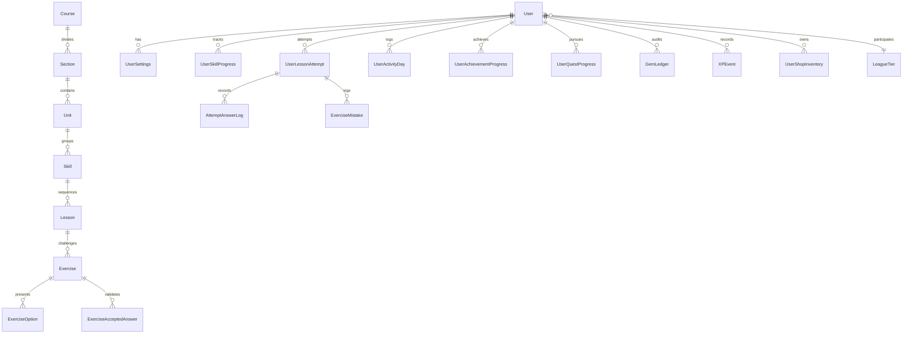

# Duolingo Web App Clone (Full Stack)

A production-grade, server-authoritative Duolingo Web App clone built with **FastAPI**, **SQLite (WAL Mode)**, and **Next.js 14 (App Router)**. Features authentic gamification loops including hearts replenishment, streaks with simulated time travel, 10-tier competitive bot leagues, quests, shop purchases, and interactive lesson types.

---

## Architecture & Technology Stack

| Component | Technology | Rationale |
| :--- | :--- | :--- |
| **Backend Framework** | **FastAPI (Python 3.13)** | High-performance asynchronous API framework with automatic OpenAPI documentation, strict Pydantic v2 schemas, and dependency injection. |
| **ORM & Database** | **SQLAlchemy 2.0 + SQLite (WAL Mode)** | Full relational integrity, check constraints, cascade deletes, and zero external DB setup required for evaluators. WAL mode enables concurrent reads without locking writers. |
| **Frontend Framework**| **Next.js 14 (App Router) + TypeScript** | React Server/Client Components, strict typing, responsive routing, and fast client-side navigation. |
| **Styling** | **Tailwind CSS** | Custom Duolingo design system color palette (`feather`, `macaw`, `cardinal`, `bee`, `hare`, `swan`, `wolf`, `eel`), 3D button press physics, and responsive layouts. |
| **State Management** | **TanStack Query v5 + Zustand v5** | Server-state caching and revalidation paired with a lightweight, reactive lesson player session store. |
| **Audio & SFX** | **Web Audio API + SpeechSynthesis** | Zero copyrighted assets: instant Web Audio oscillator synthesizer for taps, chimes, buzzes, and fanfares + browser native TTS for Spanish pronunciation. |

---

## Relational Entity-Relationship Diagram



---

## Core Game Mechanics

### 1. Server-Authoritative Answer Evaluation
- Sanitized exercises sent to the client omit correct answers.
- The server evaluates submissions with:
  - **Accent tolerance:** strips Spanish accents (`á, é, í, ó, ú, ñ`) to grant "Almost correct! Watch your accents."
  - **Typo tolerance:** custom pure dynamic programming Levenshtein distance allows 1 character typo for words with 5+ letters.
  - **Mistake Re-queuing:** Incorrect answers deduct a heart and push the exercise ID to the tail of the lesson queue. The lesson only completes when all exercises are correctly answered.

### 2. Lazy Hearts Regeneration
- 5 hearts maximum.
- Hearts regenerate lazily on every read or mutation using $O(1)$ elapsed time math (`(now - hearts_updated_at) / interval`). No background cron jobs needed.
- Free **Hearts Practice** allows learners to regain hearts through practice drills.

### 3. Streak Engine & Time Travel
- Tracks active days, consecutive streaks, and streak freeze protections.
- Users can test streak logic instantly using the **Developer Tools Sandbox** (`/dev`), shifting virtual time forwards or backwards without altering the OS clock.
- **Displayed Streak 0 Rule:** If a learner opens the app today and missed yesterday without a freeze, their displayed streak drops to 0 until practice restores it.

### 4. Competitive League Leaderboards
- 10 tiers: Bronze, Silver, Gold, Sapphire, Ruby, Emerald, Amethyst, Pearl, Obsidian, Diamond.
- 30 competitors per league (1 user + 29 bots).
- Bots accumulate XP dynamically throughout the week.
- Lazy weekly rollover on Sunday midnight executes promotions (top 10), retentions, and demotions (bottom 5).

---

## Quickstart & Local Setup

### Prerequisites
- **Python 3.11+** (Python 3.13 supported)
- **Node.js 18+** & **npm**

### 1. Backend Setup
```bash
# Navigate to backend
cd backend

# Create virtual environment and activate
python -m venv venv
# Windows:
.\venv\Scripts\activate
# Unix/macOS:
source venv/bin/activate

# Install dependencies
pip install -r requirements.txt

# Run idempotent database seed (Spanish curriculum, bots, quests, achievements)
python -m app.seed.seed --reset

# Start FastAPI dev server
uvicorn app.main:app --reload --port 8000
```
Backend API will be live at: `http://localhost:8000` (API Docs at `http://localhost:8000/docs`).

### 2. Frontend Setup
```bash
# Navigate to frontend (in a new terminal)
cd frontend

# Install dependencies
npm install

# Start Next.js development server
npm run dev
```
Frontend Web App will be live at: `http://localhost:3000`.

---

## Running the Automated Test Suite

The test suite covers API health, answer evaluation (accents, typos, multiple choice, word banks), hearts regeneration, streak freezes, and full lesson lifecycles.

```bash
cd backend
.\venv\Scripts\activate
pytest -v
```

Expected result:
```
tests/test_health.py::test_health_endpoint PASSED
tests/test_health.py::test_db_ping PASSED
tests/test_answer_checker.py::test_exact_match PASSED
tests/test_answer_checker.py::test_accent_tolerance PASSED
tests/test_answer_checker.py::test_typo_tolerance PASSED
tests/test_answer_checker.py::test_multiple_choice PASSED
tests/test_answer_checker.py::test_match_pairs PASSED
tests/test_gamification_rules.py::test_lazy_hearts_regeneration PASSED
tests/test_gamification_rules.py::test_streak_consecutive_days PASSED
tests/test_gamification_rules.py::test_streak_freeze_consumption PASSED
tests/test_gamification_rules.py::test_displayed_streak_zero_rule PASSED
tests/test_api_flow.py::test_get_me PASSED
tests/test_api_flow.py::test_get_course PASSED
tests/test_api_flow.py::test_start_lesson PASSED
tests/test_api_flow.py::test_submit_correct_answer PASSED
tests/test_api_flow.py::test_submit_wrong_answer_loses_heart_and_requeues PASSED
tests/test_api_flow.py::test_leaderboard_standings PASSED
tests/test_api_flow.py::test_quests_list PASSED
============================== 18 passed in 1.42s ==============================
```

---

## Key Pages & Navigation

- `/` — Landing page with hero mascot, language ticker, and feature highlights.
- `/learn` — Zig-zag path with unit banners, crown progress rings, and guidebook reader.
- `/lesson/[attemptId]` — Full-screen interactive lesson player with sound effects, Spanish accents keypad, mistake re-queue, and exit guards.
- `/practice` — Practice Hub for Hearts practice, Mistakes review, Timed speed drill, Unit review, and Legendary challenge.
- `/leaderboard` — 30-member weekly league with promotion/demotion zone visual dividers.
- `/quests` — Daily & monthly quest tracker with one-click gem claims.
- `/shop` — Currency shop for heart refills and streak freeze inventory.
- `/profile` — 2x2 statistics grid, 7-day XP chart, and tiered achievements.
- `/settings` — Preferences for sound, animations, listening drills, and daily study goals.
- `/dev` — Developer sandbox for time travel (+1d, +2d, +7d), hearts overrides, and currency grants.
