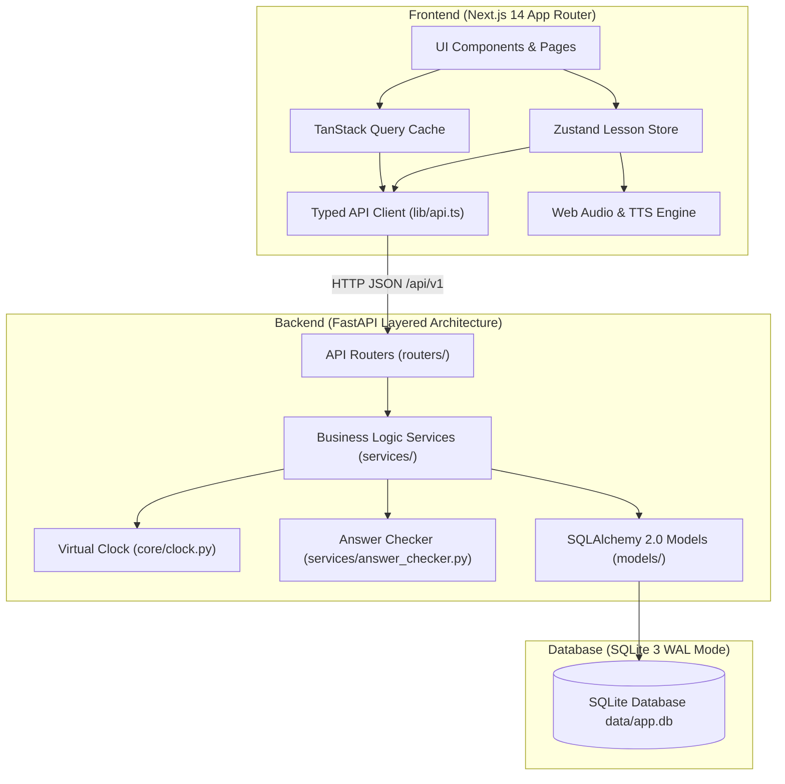
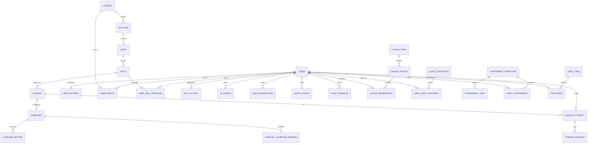

# Duolingo Web App Clone (Full Stack)

[](https://nextjs.org/)
[](https://fastapi.tiangolo.com/)
[-003B57?logo=sqlite&logoColor=white)](https://www.sqlite.org/)
[](https://www.typescriptlang.org/)
[](https://tailwindcss.com/)
[](https://pytest.org/)
[](https://opensource.org/licenses/MIT)

> **Disclaimer:** This project is an independent educational engineering clone developed for university coursework and technical evaluation. It is **not affiliated with, endorsed by, or associated with Duolingo, Inc.** All trademarks, brand names, and copyrights belong to their respective owners. No proprietary assets or trademarked artwork were scraped or utilized.

---

## Live Deployments & Repository

- **GitHub Repository:** [https://github.com/PYB05/duolingo-clone](https://github.com/PYB05/duolingo-clone)
- **Backend API (Render):** [https://duolingo-clone-qgst.onrender.com](https://duolingo-clone-qgst.onrender.com)
- **Interactive API Documentation (Swagger / OpenAPI):** [https://duolingo-clone-qgst.onrender.com/docs](https://duolingo-clone-qgst.onrender.com/docs)
- **Frontend Web Application (Vercel):** Deployed via Vercel connecting directly to the live backend API.

---

## Executive Summary

This project is a full-stack, production-ready clone of the Duolingo web application. Built with **Next.js 14 (App Router, TypeScript)** on the frontend and **Python / FastAPI + SQLite (WAL mode, SQLAlchemy 2.0)** on the backend, it faithfully replicates Duolingo’s signature visual aesthetics, design tokens, interactive lesson loops, and gamification mechanics.

Key highlights include:
1. **Server-Authoritative Lesson Engine:** Client exercises omit correct answers to eliminate client-side cheating. The server evaluates answers using Unicode normalization, Spanish diacritics / accent tolerance, dynamic programming Levenshtein distance for typos, and an automatic **mistake re-queuing** mechanism.
2. **Lazy Hearts Regeneration:** A mathematical $O(1)$ read-time regeneration algorithm that requires zero background polling workers or scheduled cron tasks.
3. **Simulated Virtual Clock & Time Travel:** A built-in time-travel engine in the Developer Sandbox (`/dev`) allowing instant testing of streak continuity, streak freeze consumption, broken streak display states, and weekly league rollovers without modifying the host operating system clock.
4. **Dynamic 10-Tier Bot Leagues:** Competitive weekly leaderboards (Bronze to Diamond) pairing the learner with 29 algorithmic bots exhibiting distinct daily learning behaviors, complete with promotion and demotion visual zones.
5. **Zero Proprietary Asset Footprint:** Synthesized sound effects using the browser's native **Web Audio API** oscillators (chimes, buzzes, taps, fanfares) and text-to-speech with a turtle speed option via the native **SpeechSynthesis API**.

---

## Feature Checklist & Scope Compliance

### 1. Core Must-Have Requirements
- [x] **Interactive Learning Path / Skill Tree:** Zig-zag node progression with SVG radial mastery rings, crowns, status indicators (locked, available, in-progress, completed, legendary), bouncing "START" indicators, and interactive unit guidebooks.
- [x] **Full-Screen Lesson Player:** 5 core exercise types (`multiple_choice`, `translate_word_bank`, `match_pairs`, `fill_in_blank`, `type_answer`) with keyboard shortcuts (`1–4`, `Enter`, `Backspace`) and a dedicated Spanish accents toolbar (`á, é, í, ó, ú, ñ, ¿, ¡, ü`).
- [x] **Signature Feedback Bar:** Bottom animated slide-up panel with green (success), red (mistake solution), and warm-yellow (typo/accent warning) states.
- [x] **Mistake Re-Queue Loop:** Incorrectly answered questions are re-queued at the tail of the session queue; the lesson only finishes once all exercises have been correctly answered.
- [x] **Hearts Gamification Loop:** 5 hearts maximum; deduction on mistakes/skips; instant lesson failure upon depletion with an Out-of-Hearts modal offering practice or gem refills.
- [x] **Streak Engine:** Consecutive day tracking, streak freeze protection, and the "Displayed Streak 0" rule for lapsed days.
- [x] **Relational Content Management:** Comprehensive Spanish curriculum with 3 Units, 12 Skills, 36 Lessons, and hundreds of exercises seeded via an idempotent migration script.
- [x] **Learner Profile & Stats:** 2×2 metrics dashboard (Streak, Total XP, League Tier, Top 3 finishes), 7-day XP activity chart, monthly streak calendar, and achievement badges.
- [x] **Duolingo UX & Dialogs:** Lesson completion screen with XP count-up, accuracy percentage, time spent, celebratory confetti (`canvas-confetti`), out-of-hearts modal, and an exit confirmation guard with `beforeunload` protection.

### 2. Bonus Features (All Fully Implemented)
- [x] **Web Audio SFX:** Custom oscillator sound synthesis for correct chimes, incorrect buzzes, button taps, and completion fanfares.
- [x] **Text-to-Speech (TTS):** Native Web Speech API integration supporting normal and 0.6x "turtle" speed in Spanish.
- [x] **Tiered Achievements & Badges:** Multi-level badges (Wildfire, Sage, Scholar, Sharpshooter, Champion, Legendary) awarding gems upon completion.
- [x] **Competitive League Leaderboards:** 10 league tiers (Bronze, Silver, Gold, Sapphire, Ruby, Emerald, Amethyst, Pearl, Obsidian, Diamond) with live bot simulation and weekly promotions/demotions.
- [x] **Timed Practice & Legendary Challenges:** 60-second speed challenge with time increments/penalties and a 15-question Legendary mastery challenge (max 2 mistakes, purple crown badge).
- [x] **Responsive Multi-Device Layout:** 3-column desktop layout ($\ge 1024$px), icon-only collapsed sidebar on tablet ($640$–$1023$px), and bottom tab bar on mobile ($< 640$px).
- [x] **Dark Mode Theme:** Duolingo dark palette (`#131F24` background, `#202F36` surface, `#37464F` border) with persistent user preference storage.

### 3. Graceful Placeholders ("Coming Soon")
- [x] **Letters, Stories & Friends:** Visual `<ComingSoon />` screens featuring a sleeping mascot and contextual informational copy.
- [x] **Super Duolingo & Shop Outfits:** Interactive modal prompts explaining simulated features with informational toasts.

---

## Tech Stack & Architectural Justifications

| Component | Technology | Version | Engineering Justification |
| :--- | :--- | :---: | :--- |
| **Frontend Framework** | **Next.js (App Router)** | `14.2.35` | Server and client component boundaries, fast file-system routing, and production build optimization. |
| **Language** | **TypeScript** | `5.x` | Strict type safety (`strict: true`, zero `any`), mirroring backend Pydantic schemas. |
| **Styling** | **Tailwind CSS** | `3.4` | Custom design system tokens (`feather`, `macaw`, `cardinal`, `bee`, `fox`, `eel`, `swan`), 3D button press physics, and responsive utilities. |
| **Server State** | **TanStack Query** | `v5` | Automatic cache invalidation (`me`, `course`, `leaderboard`, `quests`) following lesson completions and transactions. |
| **Client State** | **Zustand** | `v5` | Lightweight, un-opinionated state store for the full-screen lesson player session. |
| **Animations & Confetti** | **Framer Motion + canvas-confetti** | `11.x` | Smooth layout transitions, slide-up feedback bars, card shake animations, and victory bursts. |
| **Backend Framework** | **FastAPI** | `0.115` | Modern Python asynchronous framework with high throughput, dependency injection, and automatic OpenAPI generation. |
| **ORM & Database** | **SQLAlchemy 2.0 + SQLite (WAL)** | `2.0` | Declarative `Mapped[]` type annotations, relational constraints, and WAL mode for high-concurrency local read performance. |
| **Settings & Validation** | **Pydantic v2** | `2.10` | Strict request/response payload validation and environment configuration parsing. |
| **Testing** | **Pytest + Starlette TestClient** | `8.3` | Unit tests for pure business logic and integration tests for API endpoints. |

---

## System Architecture & Data Flow



### Architectural Layering
1. **Routers (`app/routers/`):** Thin HTTP controllers responsible solely for parsing request payloads, delegating to domain services, and returning structured Pydantic schemas.
2. **Services (`app/services/`):** Encapsulate all business rules (e.g., answer evaluation, streak increment math, lazy hearts regeneration, XP aggregation, league ranking, quest claims).
3. **Core Utilities (`app/core/`):** Cross-cutting concerns including database session lifecycle, configuration, centralized error handling, and the virtual clock.
4. **Models (`app/models/`):** Pure SQLAlchemy 2.0 declarative database entities with explicit foreign key cascades, unique constraints, and check constraints.

### Server-Authoritative Answer Checking Flow
```
User clicks CHECK / Press Enter
  │
  ├──► [Client] POST /api/v1/attempts/{id}/answer { exercise_id, answer: { ... }, time_ms }
  │
  ├──► [Backend Router] Validates payload schema via Pydantic
  │
  ├──► [Answer Checker Service]:
  │      1. Normalization: Unicode NFC, lowercasing, whitespace collapse, punctuation stripping.
  │      2. Exact Match: Evaluates against canonical answer and accepted alternatives.
  │      3. Accent Tolerance: If matching without diacritics (e.g., "esta" vs "está") -> Flagged as IS_TYPO = true ("Almost correct! Watch your accents").
  │      4. Typo Tolerance: Evaluates DP Levenshtein distance (Distance <= 1 for words >= 5 chars) -> Flagged as IS_TYPO = true.
  │
  ├──► [Hearts Service]:
  │      - Correct / Typo -> 0 hearts deducted.
  │      - Wrong -> 1 heart deducted, record heart_events row.
  │
  ├──► [Attempt Service]:
  │      - Wrong answer -> Push exercise_id to the tail of the attempt queue (Mistake Re-queuing).
  │      - Remaining hearts == 0 -> Mark attempt FAILED.
  │
  └──◄ [Response]: { is_correct, is_typo, correct_answer, hearts_remaining, requeued, failed, progress }
```

---

## Database Schema & Entity-Relationship Model



### Table-by-Table Architectural Specification

| Table Name | Primary Responsibility | Key Constraints & Indexes |
| :--- | :--- | :--- |
| `courses` | Language courses (e.g., Spanish for English speakers). | Unique learning/from language pairs. |
| `sections` | Major course milestones (e.g., Section 1: Rookie). | Foreign key to `courses`, unique `(course_id, order_index)`. |
| `units` | Themed chapters (Say hello, Food & drinks, Family). | Foreign key to `sections`, unique `(section_id, order_index)`. |
| `skills` | Curriculum nodes on the path (Basics, Greetings). | Foreign key to `units`, unique `(unit_id, order_index)`. |
| `lessons` | Specific levels per skill (Level 1, 2, 3). | Foreign key to `skills`, unique `(skill_id, level_number)`. |
| `exercises` | Individual learning challenges and prompts. | Foreign key to `lessons`, typed enum constraint on exercise kind. |
| `exercise_options` | Selectable options, pairs, or word tiles. | Cascade delete on `exercise_id`, indexed pair groups. |
| `exercise_accepted_answers` | Valid alternative phrasing for typed inputs. | Unique `(exercise_id, answer_text)` with cascade delete. |
| `users` | Learner identity and denormalized game stats. | Unique username, check constraints on daily goals (`10, 20, 30, 50`). |
| `user_settings` | User UI toggles, sound, theme, and dev offsets. | Primary key references `users.id`. |
| `enrollments` | Active language curriculum enrolment. | Unique `(user_id, course_id)`. |
| `user_skill_progress` | Completed levels and legendary status per skill. | Unique `(user_id, skill_id)`. |
| `lesson_attempts` | Full execution record of a lesson or drill. | Tracks session queue JSON, mistakes, duration, and status. |
| `attempt_answers` | Granular per-exercise answer audit log. | Cascade delete on `attempt_id`. |
| `daily_activity` | Daily aggregate summary of XP and lessons. | Composite Primary Key `(user_id, activity_date)`. |
| `xp_events` | Immutable ledger of every XP award. | Indexed on `(user_id, activity_date)` for fast weekly/daily sums. |
| `gem_transactions` | Immutable audit ledger of all gem credits/debits. | Indexed on `user_id`, tracks reason and balance changes. |
| `heart_events` | Audit log of all heart increments/deductions. | Indexed on `user_id`, records delta and reason. |
| `chest_openings` | Prevents duplicate gem claims on path chests. | Unique `(user_id, skill_id)`. |
| `league_tiers` | Tier metadata (Bronze through Diamond). | Primary key tier index (1 to 10). |
| `league_groups` | 30-competitor weekly cohort instances. | Foreign key to `league_tiers`, indexed by `week_start`. |
| `league_memberships` | User and bot standing within a weekly cohort. | Unique `(group_id, user_id)`, indexed by `(group_id, weekly_xp DESC)`. |
| `quest_definitions` | Daily and monthly quest templates. | Unique key identifier, typed metric enums. |
| `user_quest_progress` | Current progress and claim status for quests. | Unique `(user_id, quest_id, period_start)`. |
| `achievement_definitions` | Permanent achievement badges (Wildfire, Sage). | Unique key identifier. |
| `achievement_tiers` | Multi-tier thresholds and rewards per achievement. | Unique `(achievement_id, tier_number)`. |
| `user_achievements` | Learner progress towards achievement badges. | Unique `(user_id, achievement_id)`. |
| `shop_items` | Catalog of items purchasable with gems. | Unique key identifier (`heart_refill`, `streak_freeze`). |
| `purchases` | Audit log of inventory acquisitions. | Foreign keys to `users` and `shop_items`. |

### Database Design Rationale: Denormalized Totals vs. Immutable Ledgers
To balance high read performance with strict transactional auditing:
- **Denormalized Totals on `users` (`total_xp`, `hearts`, `current_streak`, `gems`):** The application shell, top stats bar, and path headers execute frequent reads. Denormalized fields eliminate costly $O(N)$ multi-table aggregation queries on every page transition.
- **Immutable Ledger Tables (`xp_events`, `heart_events`, `gem_transactions`, `daily_activity`):** Every mutation writes an immutable ledger entry within the same database transaction. This enables exact point-in-time reconstruction, daily/weekly grouping, auditing, and analytics.

---

## Core Game Mechanics & Business Logic

### 1. XP Rewards
- **Standard Lesson:** Base $10$ XP.
- **Perfect Lesson Bonus:** $+5$ XP bonus if $0$ mistakes were made.
- **Practice Drills:** $5$ XP.
- **Legendary Challenge:** $40$ XP on completion.
- **Timed Practice:** $2 \times \text{Score}$ (capped at $30$ XP).
- **Path Chests:** Award $10$–$30$ gems (no XP).

### 2. Lazy Hearts Regeneration ($O(1)$)
Rather than executing resource-intensive server-side background cron jobs to periodically increment hearts:
1. When any heart-dependent endpoint is invoked, the server computes elapsed time:
   ```python
   elapsed_seconds = (now - hearts_updated_at).total_seconds()
   ```
2. The number of hearts gained is calculated mathematically:
   ```python
   hearts_gained = math.floor(elapsed_seconds / HEART_REGEN_SECONDS)
   ```
3. Hearts balance is updated:
   ```python
   hearts = min(5, hearts + hearts_gained)
   ```
4. The timestamp is advanced by `hearts_gained * HEART_REGEN_SECONDS`. If hearts reach 5, the timestamp resets to `now`.
5. The API response returns `next_heart_in_seconds` to drive the client's live countdown timer.

### 3. Streak Engine & "Displayed Streak 0" Rule
- Completing any XP-earning activity on date `T`:
  - If last activity was on date `T`: Streak remains unchanged.
  - If last activity was on date `T - 1`: Streak increments by `+1`.
  - If last activity was on date `T - 2` and the learner owns a **Streak Freeze**: One freeze is consumed, a retroactive freeze record is created for date `T - 1`, and the streak increments by `+1`.
  - Otherwise: Streak resets to `1`.
- **Displayed Streak 0 Rule:** If a learner launches the app on date `T`, and their last activity was before `T - 1` without freeze coverage, their flame icon turns grey and displays `0`. Completing a lesson on date `T` resets the active streak to `1`.

### 4. 10-Tier Bot League Simulation
- Leagues span 10 tiers: **Bronze, Silver, Gold, Sapphire, Ruby, Emerald, Amethyst, Pearl, Obsidian, and Diamond**.
- Each group consists of 30 members (1 human learner + 29 simulated bots).
- Each bot possesses a distinct personality profile generating 15–120 XP/day with deterministic pseudo-random jitter.
- Standings are computed dynamically on query without long-running background timers.
- **Weekly Rollover:** Evaluated lazily on the first request following the conclusion of the week:
  - **Ranks 1–10:** Promoted to the next tier (+1 tier).
  - **Ranks 11–25:** Retained in the current tier.
  - **Ranks 26–30:** Demoted to the previous tier (-1 tier, clamped at Bronze).

---

## REST API Reference

All API routes are prefixed with `/api/v1`. Authentication defaults to the seeded demo learner account (`learner`).

| Method | Endpoint | Description |
| :--- | :--- | :--- |
| `GET` | `/health` | System liveness probe and database connectivity check. |
| `GET` | `/me` | Learner profile summary, hearts with regen countdown, streak, league, and simulated time. |
| `PATCH`| `/me` | Update display name or daily XP study goal. |
| `GET` | `/me/settings` | Retrieve user preferences (audio, animations, theme, listening). |
| `PATCH`| `/me/settings` | Update user preferences. |
| `GET` | `/course` | Full curriculum tree with computed skill mastery states and chest statuses. |
| `GET` | `/units/{id}/guide` | Markdown guidebook for a specific unit. |
| `POST` | `/lessons/{id}/start` | Initialize a lesson attempt and receive sanitized exercise queue. |
| `POST` | `/attempts/{id}/answer` | Submit an answer for evaluation, typo check, and mistake re-queue. |
| `POST` | `/attempts/{id}/skip` | Treat current exercise as a mistake (deducts heart, re-queues exercise). |
| `POST` | `/attempts/{id}/complete` | Finalize attempt, award XP/gems, evaluate streak, and unlock skills. |
| `POST` | `/attempts/{id}/abandon` | Abort an active lesson session. |
| `POST` | `/practice/start` | Start Hearts practice, Mistake review, Timed drill, or Legendary challenge. |
| `POST` | `/chests/{id}/open` | Open a path chest node and claim gems. |
| `GET` | `/leaderboard` | Current 30-member cohort standings with promotion/demotion zone splits. |
| `GET` | `/quests` | Retrieve daily and monthly quests with progress indicators. |
| `POST` | `/quests/{id}/claim` | Claim gem rewards for a completed quest. |
| `GET` | `/achievements` | Retrieve tiered badges and unlock progress. |
| `GET` | `/shop` | List available inventory items (heart refills, streak freezes). |
| `POST` | `/shop/{key}/purchase`| Purchase an item using accumulated gems. |
| `GET` | `/profile` | Historical stats, monthly streak calendar, and 7-day XP chart. |
| `POST` | `/dev/time-travel` | Advance or rewind virtual clock by $N$ days (`ENABLE_DEV_TOOLS=true`). |
| `POST` | `/dev/set-hearts` | Instantly set hearts balance (0–5). |
| `POST` | `/dev/add-xp` | Credit test XP to learner. |
| `POST` | `/dev/add-gems` | Credit test gems to learner. |
| `POST` | `/dev/unlock-all` | Instantly unlock all curriculum skills on the path. |
| `POST` | `/dev/reset` | Reset learner progress back to baseline seed state. |

### Standardized Error Format
All errors adhere to a uniform JSON schema with descriptive status codes:
```json
{
  "error": {
    "code": "OUT_OF_HEARTS",
    "message": "You have 0 hearts remaining. Practice or refill to continue.",
    "details": {}
  }
}
```
Standard application error codes include: `OUT_OF_HEARTS` (409), `LOCKED` (403), `INSUFFICIENT_GEMS` (409), `ATTEMPT_ALREADY_COMPLETED` (409), `NOT_FOUND` (404), and `VALIDATION_ERROR` (422).

---

## Assumptions & Design Decisions

1. **Default Logged-In Learner:** To facilitate seamless interview evaluation without external OAuth or email verification friction, requests default to the pre-seeded `learner` account (configurable via the `X-User-Id` request header).
2. **Centralized Virtual Clock:** All time calculations route through `core/clock.py`, enabling immediate virtual time travel (+1d, +2d, +7d) via `/dev` without touching the host system's hardware clock.
3. **Web Audio API & SpeechSynthesis:** Sound effects and audio prompts are generated directly in-browser using Web Audio oscillators and browser-native speech synthesis, ensuring 100% legal compliance with zero proprietary audio dependencies.
4. **Emoji Visual Assets:** Image-choice exercises leverage standard UTF-8 emojis (e.g., 🍎, 🍞, 🥛, 🐱) rather than scraped proprietary Duolingo illustrations.
5. **Mock Currency & Social Features:** Gems are an in-game simulated currency seeded at 500. Features requiring external third-party services (credit card purchases, real-time multiplayer friends, speech recognition) display polished `<ComingSoon />` views.

---

## Local Setup & Quickstart Guide

### Prerequisites
- **Python 3.11+** (Python 3.11 through 3.13 supported)
- **Node.js 18+** & **npm**

### 1. Backend Setup
```bash
# 1. Navigate to backend directory
cd backend

# 2. Create and activate a Python virtual environment
python -m venv venv
# On Windows (PowerShell):
.\venv\Scripts\Activate.ps1
# On Linux / macOS:
source venv/bin/activate

# 3. Install backend dependencies
pip install -r requirements.txt

# 4. Initialize and seed the SQLite database
python -m app.seed.seed --reset

# 5. Start the FastAPI development server
uvicorn app.main:app --reload --port 8000
```
Backend API will be accessible at `http://127.0.0.1:8000`. Interactive documentation is available at `http://127.0.0.1:8000/docs`.

### 2. Frontend Setup
```bash
# 1. Open a new terminal and navigate to frontend directory
cd frontend

# 2. Install Node dependencies
npm install

# 3. Verify environment configuration (.env)
# NEXT_PUBLIC_API_URL=http://127.0.0.1:8000/api/v1

# 4. Start Next.js development server
npm run dev
```
Frontend Web Application will be live at `http://localhost:3000`.

---

## Testing & Streak Demonstration Guide

### Running Automated Backend Tests
The backend test suite verifies answer evaluation (accents, typos, multiple choice, match pairs), lazy hearts regeneration math, streak freeze consumption, and full lesson completion lifecycles:

```bash
cd backend
.\venv\Scripts\Activate.ps1
pytest -v
```

Expected test output:
```
tests/test_answer_checker.py::test_normalize PASSED
tests/test_answer_checker.py::test_strip_accents PASSED
tests/test_answer_checker.py::test_levenshtein PASSED
tests/test_answer_checker.py::test_check_text_exact PASSED
tests/test_answer_checker.py::test_check_text_accents_typo PASSED
tests/test_answer_checker.py::test_check_text_minor_typo PASSED
tests/test_answer_checker.py::test_check_text_wrong PASSED
tests/test_answer_checker.py::test_check_multiple_choice PASSED
tests/test_answer_checker.py::test_check_match_pairs PASSED
tests/test_api_flow.py::test_api_full_flow PASSED
tests/test_gamification_rules.py::test_hearts_regen_partial PASSED
tests/test_gamification_rules.py::test_seconds_until_next_heart PASSED
tests/test_gamification_rules.py::test_streak_consecutive_days PASSED
tests/test_gamification_rules.py::test_streak_same_day PASSED
tests/test_gamification_rules.py::test_streak_missed_day_with_freeze PASSED
tests/test_gamification_rules.py::test_streak_broken PASSED
tests/test_gamification_rules.py::test_displayed_streak_zero_when_broken PASSED
tests/test_health.py::test_health_endpoint PASSED
======================== 18 passed in 2.39s ========================
```

### Demonstrating Streak Mechanics via Developer Tools Sandbox
1. Launch the web application and navigate to `/learn`. Observe the current streak counter in the top bar.
2. Click **MORE** in the left sidebar and select **Developer Tools** (or navigate directly to `/dev`).
3. Click **"+1 Day"** to advance virtual time by 24 hours.
4. Return to `/learn` and complete a quick lesson. Notice the streak counter increments by $+1$ and displays the celebratory **Streak Extended** modal.
5. In `/dev`, click **"+2 Days"** to simulate an unprotected missed day.
6. Return to `/learn`. Observe that the flame icon is grey and displays $0$ (the Displayed Streak 0 rule).
7. Complete a lesson to see the streak reset cleanly to $1$.

---

## Repository Structure

```
duolingo-clone/
├── README.md                      # Comprehensive project documentation & specifications
├── DUOLINGO_CLONE_SPEC (1).md     # Master build specification document
├── .python-version                # Pinned Python version (3.11.9) for cloud deployment
├── docs/
│   ├── ARCHITECTURE_NOTES.md      # Interview preparation guide detailing key flows
│   └── DECISIONS.md               # Architectural decision record
├── backend/
│   ├── pyproject.toml             # Backend project metadata & tooling configuration
│   ├── requirements.txt           # Pinned Python dependencies
│   ├── app/
│   │   ├── main.py                # FastAPI factory, CORS setup, router registration
│   │   ├── core/
│   │   │   ├── clock.py           # Virtual clock implementation with simulated offsets
│   │   │   ├── config.py          # Environment settings (Pydantic Settings)
│   │   │   ├── database.py        # SQLAlchemy engine, WAL pragma listener, get_db
│   │   │   └── errors.py          # Custom domain exception hierarchy & handlers
│   │   ├── models/                # Declarative SQLAlchemy 2.0 ORM entities
│   │   │   ├── course.py          # Course, Section, Unit, Skill, Lesson, Exercise
│   │   │   ├── gamification.py    # DailyActivity, XPEvent, GemTransaction, HeartEvent
│   │   │   ├── league.py          # LeagueTier, LeagueGroup, LeagueMembership
│   │   │   ├── progress.py        # UserSkillProgress, LessonAttempt, AttemptAnswer
│   │   │   ├── quest.py           # QuestDefinition, UserQuestProgress
│   │   │   ├── shop.py            # ShopItem, Purchase, ChestOpening
│   │   │   └── user.py            # User, UserSettings, Enrollment
│   │   ├── schemas/               # Typed Pydantic request & response models
│   │   ├── routers/               # Thin HTTP API endpoints (me, course, lessons, etc.)
│   │   ├── services/              # Domain logic services
│   │   │   ├── answer_checker.py  # Pure normalization, accents, and Levenshtein logic
│   │   │   ├── attempt_service.py # Lesson lifecycles, question queue, mistake re-queuing
│   │   │   ├── hearts_service.py  # Lazy O(1) hearts math, refills, practice increments
│   │   │   ├── league_service.py  # Bot simulation, cohort ranking, weekly rollovers
│   │   │   ├── streak_service.py  # Streak evaluation and freeze consumption
│   │   │   └── xp_service.py      # XP aggregation and daily activity auditing
│   │   └── seed/                  # Database seeding scripts & Spanish curriculum
│   └── tests/                     # Pytest automated test suite
└── frontend/
    ├── package.json               # Node.js dependencies and build scripts
    ├── tsconfig.json              # Strict TypeScript configuration
    ├── tailwind.config.ts         # Duolingo custom palette and 3D button styling
    ├── public/                    # Custom SVG favicon and static web assets
    └── src/
        ├── app/                   # Next.js 14 App Router pages
        │   ├── page.tsx           # Authentic Duolingo landing page
        │   ├── (app)/layout.tsx   # Authenticated shell (Sidebar, Right Rail, Top Bar)
        │   ├── (app)/learn/       # Zig-zag learning path with mastery rings
        │   ├── (app)/leaderboard/ # 10-tier league standings with bot simulation
        │   ├── (app)/practice/    # Practice hub (Hearts, Timed, Mistakes, Legendary)
        │   ├── (app)/quests/      # Daily quests & monthly badge tracker
        │   ├── (app)/shop/        # Gem shop for heart refills and streak freezes
        │   ├── (app)/profile/     # 2x2 stats grid, 7-day XP chart, achievement badges
        │   ├── (app)/settings/    # User preferences (sound, dark mode, goals)
        │   ├── (app)/dev/         # Developer sandbox (time travel, currency overrides)
        │   └── lesson/[id]/       # Full-screen lesson player
        ├── components/            # Reusable UI component library
        │   ├── ui/                # Button (3D sink), Modal, ProgressBar, Toast
        │   ├── layout/            # Sidebar, BottomNav, TopStatsBar, RightRail
        │   ├── path/              # UnitBanner, PathNode, ProgressRing, ChestNode
        │   ├── lesson/            # LessonHeader, FeedbackBar, CompleteScreen, modals
        │   │   └── exercises/     # Exercise components (MultipleChoice, WordBank, etc.)
        │   └── mascot/            # Original Owl vector mascot with varied expressions
        ├── lib/                   # api.ts (typed client), sfx.ts (Web Audio), tts.ts (TTS)
        ├── store/                 # Zustand lesson session store
        └── types/                 # Shared TypeScript interfaces
```

---

## Future Roadmap & Enhancements

1. **Multi-User OAuth2 Authentication:** Replace the default demo learner with production OAuth2 / JWT authentication (e.g., Supabase, Auth0, or custom bcrypt).
2. **PostgreSQL Production Migration:** Migrate from SQLite to PostgreSQL with read replicas for high-volume production deployments.
3. **WebSockets for Real-Time Leaderboards:** Transition leaderboard updates from query-time polling to real-time WebSocket events.
4. **Speech Recognition via Web Speech API:** Implement real-time microphone pronunciation evaluation using the Web Speech Recognition API.
5. **Multi-Language Expansion:** Expand the seeded curriculum from Spanish to French, German, and Japanese using the existing relational schema.

---

## License

This project is licensed under the [MIT License](LICENSE).
